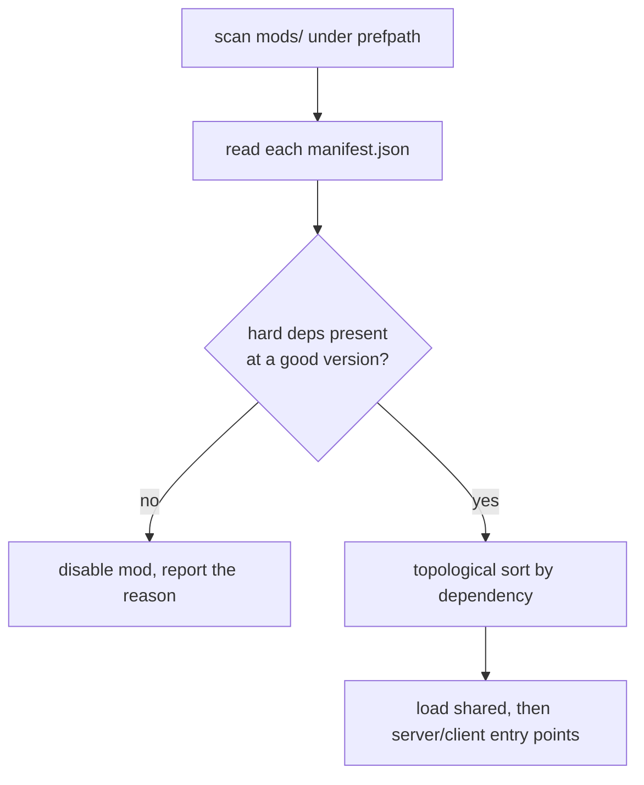
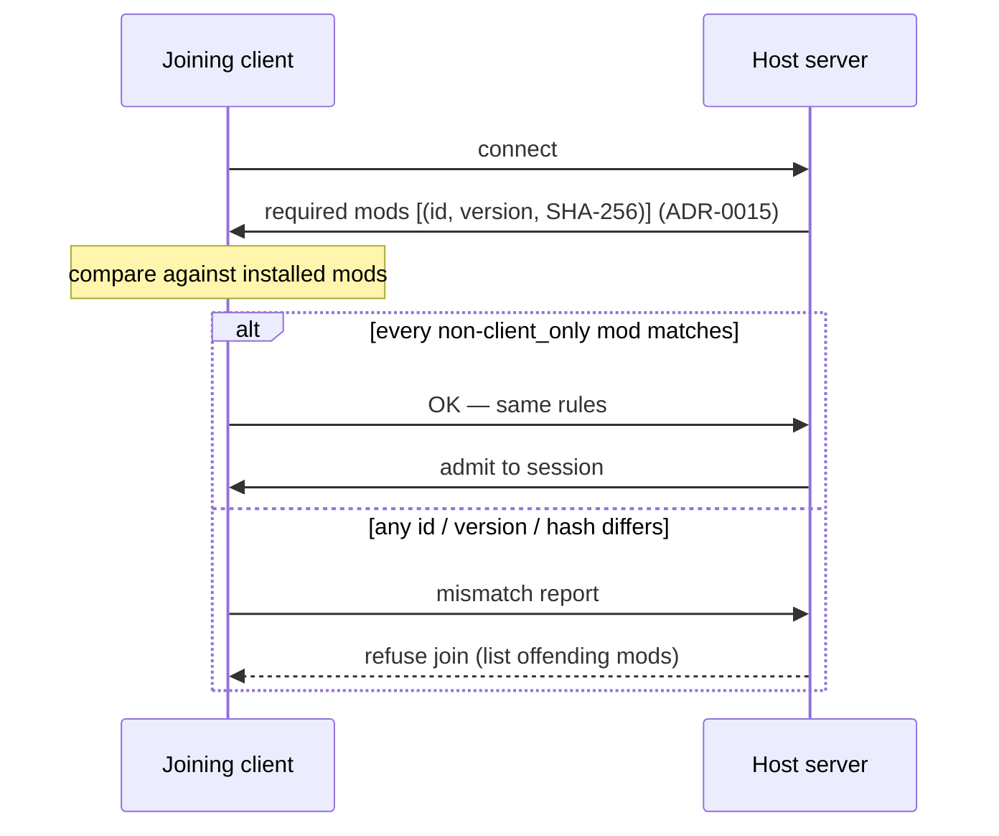

# Mod Packaging

## What it is

A mod will be a self-contained, id-addressed directory: a manifest plus its data and scripts, named `{id}_{version}` and shared as a matching zip. The manifest declares the mod's id, version, api level, dependencies, and its server/client/shared entry points — the whole contract in one hand-editable file. The engine will load mods this way when scripting lands at milestone M6 ([ADR-0015](../../engine/architecture/adr-0015-luau-modding.md)); nothing here is built yet (the project is pre-M1).

The shape is borrowed, not invented. Factorio identifies every mod by an `info.json` and the rule that "the mod folder... must either be named in the pattern of `{mod-name}_{version-number}`"; Luanti does the same with a `mod.conf` whose directory must be named for the mod itself. Both make the directory the unit of distribution and the id its address. This engine's manifest will follow that lineage.

## Why you care

Co-op is the reason packaging is strict. The product bet is exact: **a friend adds an enemy with a JSON file + 20 lines of Luau, hash-verified into the co-op session, and a bad mod can't crash the game or corrupt saves.** "Hash-verified" is what this page is about — the join handshake that proves every player is running the same rules.

The manifest is that contract. Its id is who the mod is; its version and content hash are which exact build; its `api` level is which binding generation it targets (that field has [its own page](./api-versioning.md)). Get the manifest right and a stranger's mod drops into your session with no build step.

!!! warning
    Hash matching is a **compatibility and honesty** check — same mods, same versions on both ends — **not** anti-cheat, and the sandbox around a mod is **containment, not an OS-level security boundary**. Never call it "secure." Why a matched hash still isn't a security boundary is [its own page](./honest-limits-of-mod-security.md).

## Quick start

A mod on disk, living under `SDL_GetPrefPath` because every write does ([ADR-0021](../../engine/architecture/adr-0021-writes-under-prefpath.md)):

```text
mods/                                 # under SDL_GetPrefPath (ADR-0021)
└── ashcrawler_1.2.0/                 # folder name = {id}_{version}
    ├── manifest.json                 # id, version, api, deps, entry points
    ├── data/enemies/ashcrawler.json
    └── scripts/
        ├── shared.luau
        ├── server.luau
        └── client.luau
```

The manifest, JSON-with-comments ([ADR-0013](../../engine/architecture/adr-0013-json-authored-bitstream-wire.md)):

```json
{
  "id": "ashcrawler",
  "version": "1.2.0",
  "api": 3,
  "title": "Ashcrawler Enemy",
  "author": "yourfriend",
  "dependencies": {
    "base-colony": ">=0.4.0",
    "shared-fx": "?"
  },
  "entry": {
    "shared": "scripts/shared.luau",
    "server": "scripts/server.luau",
    "client": "scripts/client.luau"
  },
  "client_only": false
}
```

Zip it as `ashcrawler_1.2.0.zip` to share. The folder name carries id and version so two versions never collide; the id addresses the mod everywhere else.

## How it works

Two mechanisms: deciding load order at startup, then matching hashes at join.

Load order is dependency-driven. The engine will scan `mods/`, read each manifest, verify every hard dependency is present at a compatible version, drop any mod whose deps are unmet (reporting why), then topologically sort the survivors so a mod loads after everything it depends on — Factorio's rule that "if this mod depends on another, the other mod will load first."



The join handshake is the co-op gate. The host will be authoritative, so its mod set is the truth. On connect the host will send, per mod, an `(id, version, SHA-256)` triple; the client will have to match every mod not flagged `client_only` ([ADR-0015](../../engine/architecture/adr-0015-luau-modding.md)). A `client_only` mod — a cosmetic HUD skin, say — changes nothing the server simulates, so it will be exempt. Any other mismatch will refuse the join with the offending list. (How that triple is encoded on the wire belongs to [Serialization basics](../architecture/serialization-basics.md).)



The check itself is a plain set comparison — no engine needed to see its shape:

```cpp
#include <cstdio>
#include <string>
#include <unordered_map>
#include <vector>

struct ModId {
    std::string id;
    std::string version;
    std::string sha256;  // hex digest of the mod's canonical bytes
    bool client_only;
};

// Everything not client_only must match id+version+sha256, or the join fails.
static std::vector<std::string>
mismatches(const std::vector<ModId>& required,
           const std::unordered_map<std::string, ModId>& have) {
    std::vector<std::string> bad;
    for (const ModId& want : required) {
        if (want.client_only) continue;  // cosmetic-only: not gated
        auto it = have.find(want.id);
        if (it == have.end() || it->second.version != want.version ||
            it->second.sha256 != want.sha256)
            bad.push_back(want.id);
    }
    return bad;
}

int main() {
    std::vector<ModId> required{
        {"base-colony", "0.4.0", "aa11", false},
        {"ashcrawler", "1.2.0", "bb22", false},
        {"fancy-hud", "0.9.0", "cc33", true},  // client_only: skipped
    };
    std::unordered_map<std::string, ModId> have{
        {"base-colony", {"base-colony", "0.4.0", "aa11", false}},
        {"ashcrawler", {"ashcrawler", "1.1.0", "zz99", false}},  // wrong ver
    };
    for (const std::string& id : mismatches(required, have))
        std::printf("mismatch: %s\n", id.c_str());  // prints: ashcrawler
}
```

## Pros / Cons

| Pros | Cons |
|---|---|
| Directory is the unit — mountable from any path, no portal | Hash mismatch blocks the join; someone must update |
| Text manifest is diffable and hand-editable (ADR-0013) | No streamed or partial mod download pre-players |
| `{id}_{version}` names let two versions coexist | Re-zip and re-hash on every content change |
| Deterministic load order from declared deps | Dependency conflicts are the mod author's to resolve |

## What to expect

M6 will land manifest parsing, load-order resolution, hash matching, and hot reload together ([ADR-0015](../../engine/architecture/adr-0015-luau-modding.md)); the first-party base pack is planned to ship as a mod in `mods/` under these same rules ([ADR-0006](../../engine/architecture/adr-0006-first-party-as-a-mod-ratchet.md)). A planned `--validate-mods` headless CLI will check a manifest before you ever launch, and a broken mod is meant to disable itself cleanly rather than take the game down.

!!! info
    Reloading a mod's scripts without restarting the session — teardown, recompile, rebuild state — is a separate mechanism, covered in [Hot reload](./hot-reload.md).

## Go deeper

- [Hot reload](./hot-reload.md) — swapping a mod's scripts mid-session.
- [API versioning](./api-versioning.md) — what the manifest's `api` field means.
- [Honest limits of mod security](./honest-limits-of-mod-security.md) — why a matched hash is not a security boundary.
- [Sandboxing](./sandboxing.md) and [Binding a script API](./binding-a-script-api.md) — what runs once a mod is loaded.
- [Serialization basics](../architecture/serialization-basics.md) — the wire encoding of the handshake triple (ADR-0013).
- [The command funnel](../architecture/command-funnel.md) — the one door a loaded mod's mutations enter.
- [Handles, not pointers](./handles-not-pointers.md) — why a mod never holds a raw `Entity*`.
- [ADR-0015: Luau modding](../../engine/architecture/adr-0015-luau-modding.md) — canonical for the handshake and per-mod VM.
- [ADR-0021: Writes under prefpath](../../engine/architecture/adr-0021-writes-under-prefpath.md) — where `mods/` lives.
- [ADR-0013: JSON authored data](../../engine/architecture/adr-0013-json-authored-bitstream-wire.md) — the manifest format.
- [ADR-0006: First-party-as-a-mod ratchet](../../engine/architecture/adr-0006-first-party-as-a-mod-ratchet.md) — the base pack ships as a mod.

**Sources**

- Factorio API docs — Mod structure — https://lua-api.factorio.com/latest/auxiliary/mod-structure.html — accessed 2026-07-06
- Luanti (Minetest) Modding Book — rubenwardy — https://rubenwardy.com/minetest_modding_book/ — accessed 2026-07-06
