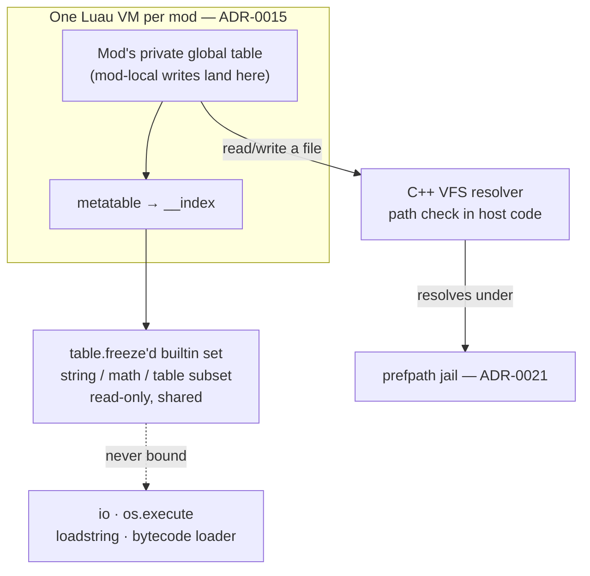

# Sandboxing a Luau VM

## What it is

A sandbox is the wall between a mod's code and everything it could break. The engine will load community mods as Luau scripts ([ADR-0015](../../engine/architecture/adr-0015-luau-modding.md)); the sandbox lets a stranger's `.luau` file run in your session without touching the disk, the network, or another mod's state.

The goal, from the master plan: **a friend adds an enemy with a JSON file + 20 lines of Luau, hash-verified into the co-op session, and a bad mod can't crash the game or corrupt saves.** That is the whole promise — a bad mod, not a determined attacker. This page is the containment that plans to deliver it.

## Why you care

Coming from Python or JS, you reach for `import os` or `require('fs')` without a thought. Hand that reflex to a modder and one typo — or one grief-troll — deletes a save or hangs the tick. C++ gives no runtime net: a script that loops forever takes the whole process down.

The engine will confine each mod so it **cannot** reach those doors (ADR-0015). The sandbox is what makes "download a stranger's mod and click Play" sane to offer — and every binding you later expose (see [Binding a Script API](./binding-a-script-api.md)) either respects this wall or punches a hole in it.

!!! warning
    The sandbox is **containment, not an OS-level security boundary**. Never call it "secure." A memory-safety bug in the VM means arbitrary code in the game process; servers running strangers' mods belong in a container (ADR-0015). Full boundary: [Honest Limits of Mod Security](./honest-limits-of-mod-security.md).

## Quick start

Everything a hostile mod would try is simply *absent*:

```luau
-- fragment — a hostile-mod fixture: every line is denied by the sandbox
os.execute("rm -rf ~")            -- nil: os.execute removed
local f = io.open("/etc/passwd")  -- nil: the io library is gone
loadstring(payload)()             -- nil: no source-string loader
string.rep = function() end       -- error: builtin tables are frozen
```

The engine plans one such VM per mod (ADR-0015). None of this is blocked by a filter you could forget — those functions were never in the mod's world at all.

## How it works

Four layered parts:



1. **One VM per mod** (ADR-0015). Separate `lua_State`s mean one mod cannot read or clobber another's globals — isolation by construction, not discipline.
2. **A frozen builtin set.** The safe library subset (`string`, `math`, `table`, …) will be `table.freeze`'d: read-only VM-wide. Monkey-patching `string.format` errors out, sparing the next reader a booby trap.
3. **Per-VM global table with `__index`.** Each mod will get a fresh, writable global table whose metatable's `__index` falls through to the frozen builtins. Writes stay local; reads see the shared library.
4. **No bytecode, and no runtime source loader.** Untrusted bytecode is the classic Lua escape — it skips the compiler's checks and can corrupt the VM — so the engine will strip `string.dump`/`load` and every bytecode path (ADR-0015). `loadstring` goes too, for a separate reason: the engine will compile mod *source* ahead of time, so no runtime source-string loader is needed.

Files are the one open door, guarded in C++. Path resolution will run in host code so a mod cannot smuggle `../../` out of its jail; every write will land under `prefpath` ([ADR-0021](../../engine/architecture/adr-0021-writes-under-prefpath.md)):

```cpp
// The VFS jail: a mod names a path, C++ decides if it is allowed. Purely
// lexical — never touches the filesystem — so it is deterministic and testable.
#include <cassert>
#include <filesystem>
#include <optional>

namespace fs = std::filesystem;

std::optional<fs::path> resolve_in_jail(const fs::path& root, const fs::path& rel) {
    if (rel.is_absolute()) return std::nullopt;              // no "/etc/passwd"
    const fs::path base = root.lexically_normal();
    const fs::path full = (base / rel).lexically_normal();
    auto b = base.begin(), f = full.begin();
    for (; b != base.end(); ++b, ++f)                        // base must prefix full
        if (f == full.end() || *f != *b) return std::nullopt;  // "../" escaped
    return full;
}

int main() {
    const fs::path root = "/mods/coolmod";
    assert(resolve_in_jail(root, "data/units.json").has_value());
    assert(!resolve_in_jail(root, "../othermod/secret").has_value());
    assert(!resolve_in_jail(root, "/etc/passwd").has_value());
}
```

Wiring the frozen builtins onto each mod's global table is likewise host-side:

```cpp
// fragment — does not compile alone
lua_State* L = luaL_newstate();          // engine compiles source, never loads bytecode
open_frozen_builtins(L);                 // string/math/table subset, then table.freeze
lua_newtable(L);                         // this mod's private, writable global table
lua_newtable(L);                         // its metatable...
lua_pushvalue(L, frozen_builtins_idx);
lua_setfield(L, -2, "__index");          // ...reads fall through to the frozen builtins
lua_setmetatable(L, -2);
```

## Pros / Cons

- **Pro**: removal beats filtering — you cannot forget to block a function that was never added.
- **Pro**: per-VM isolation contains a misbehaving mod to its own VM; the sim keeps ticking.
- **Pro**: Luau was engineered against hostile code from day one (ADR-0015), so you inherit Roblox's abuse-testing.
- **Con**: the wall is only as good as your bindings — one C++ callback that dereferences a mod-supplied index reopens everything (see [Handles, Not Pointers](./handles-not-pointers.md)).
- **Con**: containment is not security. It stops accidents and casual griefing, not a VM zero-day.

## What to expect

The enforcement is not the `table.freeze` call — it is the **hostile-mod fixture suite**: ≥15 evil `.luau` files that each *try* to escape and must fail, plus an abuse test with every new binding (ADR-0015). It is "done" when those fixtures stay red-on-escape in CI, not when the code looks right.

!!! info
    Hash-matching a mod on join is **compatibility and honesty** — everyone runs the same code — **not anti-cheat**. It confirms a save loaded the mod it was built with, not that a client is unmodified. That handshake lives in [Mod Packaging](./mod-packaging.md); versioning in [API Versioning](./api-versioning.md).

CPU and memory budgets — the defense against that infinite loop — get their own page: [Script Resource Budgets](./script-resource-budgets.md).

## Go deeper

- [Binding a Script API](./binding-a-script-api.md) — what gets exposed *through* the wall.
- [Handles, Not Pointers](./handles-not-pointers.md) — opaque handles, never raw addresses.
- [Script Resource Budgets](./script-resource-budgets.md) — the CPU and memory half.
- [Honest Limits of Mod Security](./honest-limits-of-mod-security.md) — containment, not security.
- [Hot Reload](./hot-reload.md) — VM teardown and rebuild without leaking state.
- [RAII](../cpp/raii.md), [Ownership & Smart Pointers](../cpp/ownership-smart-pointers.md) — a `lua_State*`'s lifetime.
- [Footguns From Other Languages](../cpp/footguns-from-other-languages.md) — the `import os` reflex.
- [Debugging With Sanitizers](../cpp/debugging-with-sanitizers.md) — catching binding memory bugs.
- [Command Funnel](../architecture/command-funnel.md), [ECS Pattern](../architecture/ecs-pattern.md) — the state a mod may nudge.
- [ADR-0015: Luau modding](../../engine/architecture/adr-0015-luau-modding.md) — canonical for every claim here.
- [ADR-0006: First-party as a mod ratchet](../../engine/architecture/adr-0006-first-party-as-a-mod-ratchet.md) — first-party dogfoods this sandbox.
- [ADR-0021: Writes under prefpath](../../engine/architecture/adr-0021-writes-under-prefpath.md) — where the jail resolves.

**Sources**

- Embedding a sandboxed Luau virtual machine — https://luau.org/sandbox — accessed 2026-07-06
- lua-users wiki: Sand Boxes (http-only) — http://lua-users.org/wiki/SandBoxes — accessed 2026-07-06
- Programming in Lua (1st ed.), ch. 14 — The Environment — https://www.lua.org/pil/14.html — accessed 2026-07-06

Video: [javidx9 — Embedding Lua in C++ #1](https://www.youtube.com/watch?v=4l5HdmPoynw) — 36 min. Watch first if you have never wired a Lua VM into C++; it builds the `lua_State` embedding this page then locks down.
