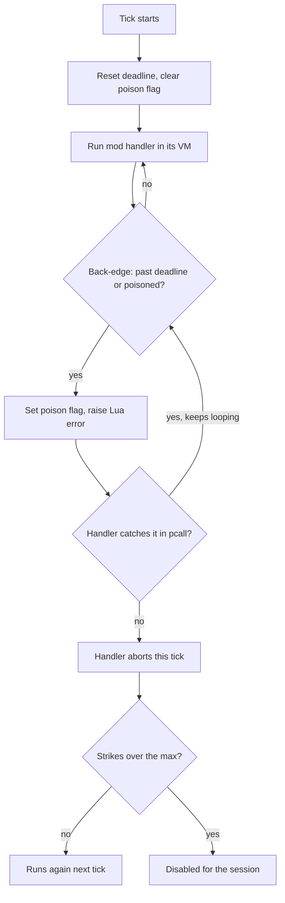

# Script Resource Budgets

## What it is

A **resource budget** is the ceiling the engine puts on what one mod's script may spend in a single 60 Hz tick — CPU time, memory, and consecutive failures — so a runaway mod degrades into a disabled handler, not a frozen game. The engine will run one Luau VM per mod (**[ADR-0015](../../engine/architecture/adr-0015-luau-modding.md)**); each VM gets a per-tick CPU **deadline** from Luau's interrupt callback, a ~64 MB cap from an **allocator hook**, and a **strike count** that drops a handler that keeps throwing.

This page covers only those budgets. The jail that stops a mod from reaching the filesystem or network is [sandboxing](sandboxing.md); what budgets can't stop lives in [honest-limits-of-mod-security](honest-limits-of-mod-security.md).

## Why you care

The tick is fixed at 60 Hz — simulation, physics, and netcode share one 16.6 ms frame ([fixed-timestep](../architecture/fixed-timestep.md)). A mod handler runs inside that frame. Without a budget, one `while true do end` in a friend's mod stalls the tick; on a listen server that stalls **everyone** in the session. The design promise is exact: **a friend adds an enemy with a JSON file + 20 lines of Luau, hash-verified into the co-op session, and a bad mod can't crash the game or corrupt saves** ([master plan](../../design/master-plan.md)). "Can't crash the game" is the budget's job.

!!! warning
    This is **containment, not a security boundary**. Budgets stop a bad mod from stalling the tick or exhausting memory; they are never called "secure." Hash matching is compatibility and honesty — proof everyone runs the same bytes — not anti-cheat. See [honest-limits-of-mod-security](honest-limits-of-mod-security.md).

## Quick start

The budget is a little host-side state, reset at the top of every tick and read from inside the interrupt. Here it is in plain C++, no Luau headers:

```cpp
#include <cassert>
#include <chrono>

using Clock = std::chrono::steady_clock;

// One per mod VM, reset at the top of every 60 Hz tick.
struct Budget {
    Clock::time_point deadline;      // wall-clock cutoff for this tick
    bool poisoned = false;           // set once the deadline is blown
    int  strikes  = 0;               // consecutive ticks this handler aborted
    static constexpr int kMaxStrikes = 5;

    void begin_tick(Clock::duration slice) {
        deadline = Clock::now() + slice;
        poisoned = false;
    }
    // Called from the interrupt on every loop back-edge.
    bool over_budget() {
        if (Clock::now() > deadline) poisoned = true;
        return poisoned;             // stays poisoned — pcall can't un-blow it
    }
    // Called after the handler returns or aborts.
    bool disable(bool aborted) {
        strikes = aborted ? strikes + 1 : 0;
        return strikes >= kMaxStrikes;   // true → drop this handler for good
    }
};

int main() {
    Budget b;
    b.begin_tick(std::chrono::milliseconds(2));
    assert(!b.poisoned);
    b.deadline = Clock::now() - std::chrono::milliseconds(1);  // pretend we ran long
    assert(b.over_budget());          // deadline blown → poisoned
    assert(b.over_budget());          // still poisoned even after a "recovered" clock
    for (int i = 0; i < 4; ++i) assert(!b.disable(true));      // strikes 1..4
    assert(b.disable(true));          // 5th strike → handler disabled
}
```

The interrupt only calls `over_budget()`; the strike counter alone decides whether a repeatedly-failing handler stays loaded.

## How it works

Four mechanisms stack. **CPU:** Luau guarantees the host interrupt fires "eventually" — in practice on every loop back-edge and function call (luau.org). The engine will set the deadline at tick start and raise a Lua error the instant the clock passes it:

```cpp
// fragment — does not compile alone
#include <lua.h>   // Luau VM C API

// One interrupt per VM (ADR-0015). Luau calls it on loop back-edges and calls.
static void mod_interrupt(lua_State* L, int gc) {
    if (gc >= 0) return;                 // ignore GC pings; act on the periodic check
    if (budget_for(L).over_budget())
        lua_error(L);                    // unwind the mod — it's over its deadline
}

void install_budget(lua_State* L) {
    lua_callbacks(L)->interrupt = mod_interrupt;
}
```

**Poison flag:** a raised error is catchable — a mod could wrap its loop in `pcall` and swallow the budget error to keep spinning. The flag above is the defense: once the deadline blows it stays set, so the interrupt re-raises on the next back-edge, straight through any `pcall`. **Memory:** the VM will be created with an allocator that denies any request past the ~64 MB cap; Luau turns the denial into out-of-memory.

```cpp
// fragment — does not compile alone
#include <cstdlib>
struct MemCap { size_t used = 0, cap = 64u * 1024 * 1024; };  // ~64 MB per VM

// Return nullptr past the cap → Luau raises "not enough memory" (ADR-0015).
static void* capped_alloc(void* ud, void* ptr, size_t osize, size_t nsize) {
    auto* m = static_cast<MemCap*>(ud);
    if (nsize == 0) { std::free(ptr); m->used -= osize; return nullptr; }
    if (m->used - osize + nsize > m->cap) return nullptr;     // deny — over cap
    void* p = std::realloc(ptr, nsize);
    if (p) m->used += nsize - osize;
    return p;
}
```

**Strikes:** aborting once is normal. A handler that aborts every tick is dropped after a few strikes instead of burning the deadline forever.



The interrupt has blind spots the hostile-mod fixture suite must cover (ADR-0015). A **long-running C function** — one `string.rep` building a giant string — never reaches a back-edge, so the interrupt can't fire mid-call; bound those at the [binding](binding-a-script-api.md), not the loop. **Pathological string patterns** burn seconds in one C call for the same reason. **Timer/event spam** — thousands of registered callbacks — spreads cost across small handlers that each pass the per-tick check, so the event API will be metered by count too.

## Pros / Cons

| Choice | Pro | Con |
|---|---|---|
| Interrupt deadline + poison flag | stops runaway loops mid-tick; `pcall` can't dodge it | wall-clock, jittery on a busy host; blind inside a C call |
| Allocator memory cap | hard ~64 MB per VM | counts VM allocations, not C++-side binding memory |
| Strike-disable | a bad handler self-removes | flaky-one-tick handlers survive; tune the threshold |
| Bare `pcall`, no budget | trivial | one loop freezes the tick and every peer |

## What to expect

Scripting lands at M6 ([ADR-0015](../../engine/architecture/adr-0015-luau-modding.md)); budgets ship with it, each documented limit proven by an evil `.luau` in the ≥15-file hostile-mod suite. Expect honest gaps: the deadline is wall-clock, so budgets are non-deterministic and never sit in the replayed sim path (that path stays C++ — [ADR-0005](../../engine/architecture/adr-0005-predicted-movement-is-cpp.md)); a slow C binding is invisible until it returns; and the cap counts VM memory, not C++-side binding allocations.

## Go deeper

- [sandboxing](sandboxing.md) — the jail; budgets and jail are the two halves of containment
- [binding-a-script-api](binding-a-script-api.md) — where you bound the long-running C calls the interrupt can't see
- [hot-reload](hot-reload.md) — how a disabled handler gets a second chance
- [honest-limits-of-mod-security](honest-limits-of-mod-security.md) — what no budget can stop
- [fixed-timestep](../architecture/fixed-timestep.md) — the 16.6 ms frame the budget protects
- [game-loop](../architecture/game-loop.md) — where the mod handler is called from
- [determinism-limits](../physics/determinism-limits.md) — why wall-clock budgets stay out of the sim path
- [footguns-from-other-languages](../cpp/footguns-from-other-languages.md) — the `while true do` reflex budgets catch
- [ADR-0015](../../engine/architecture/adr-0015-luau-modding.md) · [ADR-0005](../../engine/architecture/adr-0005-predicted-movement-is-cpp.md) · [ADR-0006](../../engine/architecture/adr-0006-first-party-as-a-mod-ratchet.md) — modding, C++-hot-path, and eat-your-own-budgets commitments

**Sources**

- Embedding a sandboxed Luau virtual machine (interrupts) — https://luau.org/sandbox — accessed 2026-07-06
- Luau VM C API — `lua_Callbacks::interrupt`, the safepoint hook this page meters against (fires on loop back-edges, calls, and GC) — https://github.com/luau-lang/luau/blob/master/VM/include/lua.h — accessed 2026-07-06
- Factorio Runtime API docs (event-driven API exemplar) — https://lua-api.factorio.com/latest/ — accessed 2026-07-06

**Video**: Embedding Lua in C++ #1 — javidx9 — https://www.youtube.com/watch?v=4l5HdmPoynw — 35 min. Watch before this page if the host-drives-the-VM loop is new: it wires a bare Lua VM into a C++ program, the seam these hooks plug into.
