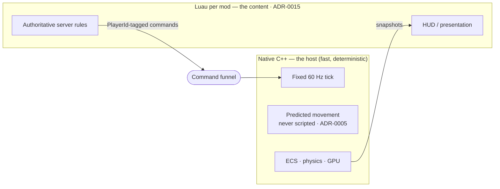

# Why Embed a Scripting Language

## What it is

Embedding a scripting language means the C++ engine ships a small interpreter inside its own process and hands it chunks of gameplay logic to run. The engine stays the fast native host — tick loop, ECS, physics, rendering — while the interpreter executes higher-level rules loaded from text files at runtime, never compiled into your binary and read like any other asset.

This engine will embed Luau, one virtual machine per mod, when scripting lands at M6 (ADR-0015). This page is not about **which** language, or **how** it is confined — it is the prior question: why host an in-process interpreter at all, instead of writing every behavior in C++?

## Why you care

Three forces push behavior out of C++ and into a script:

- **Iteration without recompiles.** A C++ change means a recompile-and-relink cycle before you can test it; a script change is a file save. You tweak balance thousands of times, and "waiting for a glacial recompile... kills your creative flow" (*Game Programming Patterns*).
- **Behavior as data.** A spell, a recipe, an enemy's on-hit reaction — these are content, not engine. Expressed as data the engine interprets, they change without a programmer touching the build.
- **Modders without a toolchain.** This engine's whole point is session-moddable co-op. If extending it demanded a C++ compiler and the engine sources, almost nobody would; a script needs only a text editor.

The engine's concrete target, stated verbatim in the master plan: **a friend adds an enemy with a JSON file + 20 lines of Luau, hash-verified into the co-op session, and a bad mod can't crash the game or corrupt saves.**

## Quick start

The kernel of the idea, in pure C++ — a table mapping a name to a behavior:

```cpp
#include <cstdio>
#include <functional>
#include <string>
#include <unordered_map>

int main() {
    // "Behavior as data": the engine owns the table; content selects by name.
    std::unordered_map<std::string, std::function<int(int)>> effects{
        {"burn", [](int hp) { return hp - 10; }},
        {"heal", [](int hp) { return hp + 5; }},
    };

    int hp = 20;
    for (const char* name : {"burn", "heal", "burn"}) {
        hp = effects.at(name)(hp);
        std::printf("%-4s -> hp %d\n", name, hp);
    }
}
```

The engine owns the table; content picks entries by name. A scripting VM takes this to its conclusion: the **entries themselves** become programs authored in a file, so new behavior arrives without recompiling this binary. That is all "embed a scripting language" means.

## How it works

The engine draws a hard line through gameplay. Native C++ keeps everything that must be fast, deterministic, or predicted; script gets the content — authoritative server rules and presentation.

The load-bearing rule: **mods script authoritative server logic and presentation, never the client-predicted movement path** (ADR-0005). Prediction needs a pure `(state, input) -> state` function re-simulated many times per frame; a script call in that loop would break determinism, blow the CPU budget, and force mod code to run bit-identically on two machines — a contract no one can honor. Predicted movement stays C++.



A modder's side stays small. The enemy is a data file (ADR-0013)...

```json
{
  "id": "ashcrawler",
  "extends": "base.enemy",
  "hp": 40,
  "on_hit": "scripts/ashcrawler.luau"
}
```

...and its behavior is a short script the server runs authoritatively:

```luau
-- fragment
local function on_hit(target)
    target.hp = target.hp - 10
    if target.hp <= 0 then
        world.kill(target)
    end
end

return { on_hit = on_hit }
```

Same-named content carries a hash, and the join handshake matches hashes so everyone runs the same rules. That match is about **compatibility and honesty — is everyone playing the same game? — not anti-cheat** (handshake mechanics belong to [Mod Packaging](./mod-packaging.md)).

## Pros / Cons

- **Pro:** iteration in a file-save, not a rebuild.
- **Pro:** content authored without a compiler or your sources.
- **Pro:** first-party gameplay migrates onto the **same** public mod API — proof it is complete (ADR-0006).
- **Con:** an interpreter is slower than native code — never put it on a hot path (ADR-0005 keeps it off the predicted one).
- **Con:** a second language and binding layer to maintain.
- **Con:** containment is not security (see below).

## What to expect

First-party-as-a-mod is how the API proves itself. From M6 onward each milestone moves at least one shipped feature onto the public mod API, into `mods/` (ADR-0006): if the base game builds on it, so can mods, and the base pack becomes the best documentation — real code, not toy samples.

!!! warning
    The sandbox is containment, not an OS-level security boundary — never call it "secure." The promise is bounded: a bad mod can't crash the game or corrupt saves. A VM zero-day still means code execution in the game process, so dedicated servers running strangers' mods belong in a container.

!!! info
    Not every behavior belongs in a script. The predicted movement path is C++ by decision (ADR-0005); the choice of Luau, and how the VM is confined, are their own pages below.

## Go deeper

- [Luau Overview](./luau-overview.md) — which language, and why.
- [Sandboxing](./sandboxing.md) — how the VM is confined once embedded.
- [Binding a Script API](./binding-a-script-api.md) — exposing C++ functions to scripts.
- [Mod Packaging](./mod-packaging.md) — manifests, load order, the handshake hash check.
- [The Command Funnel](../architecture/command-funnel.md) — the one door every mod mutation enters.
- [Data-Oriented Design](../architecture/data-oriented-design.md) — the "behavior as data" habit.
- [Determinism Limits](../physics/determinism-limits.md) — why the predicted path can't be scripted.
- [Footguns From Other Languages](../cpp/footguns-from-other-languages.md) — native hazards a script hides.
- [ADR-0015: Luau modding](../../engine/architecture/adr-0015-luau-modding.md) — canonical for every VM/sandbox/API claim.
- [ADR-0005: Predicted movement is C++](../../engine/architecture/adr-0005-predicted-movement-is-cpp.md) — the C++/script line.
- [ADR-0006: First-party-as-a-mod ratchet](../../engine/architecture/adr-0006-first-party-as-a-mod-ratchet.md) — the API as proof of completeness.
- [ADR-0013: JSON for authored data](../../engine/architecture/adr-0013-json-authored-bitstream-wire.md) — the manifest format above.

**Sources**

- Game Programming Patterns — Bytecode — https://gameprogrammingpatterns.com/bytecode.html — accessed 2026-07-06
- Why Luau? — https://luau.org/why — accessed 2026-07-06
- Using Lua with C++ (Elias Daler) — https://edw.is/using-lua-with-cpp/ — accessed 2026-07-06
