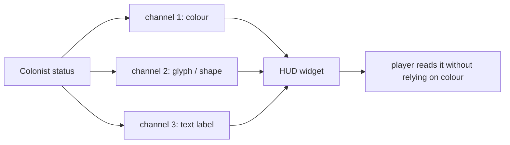

# Accessibility Basics

## What it is

**Accessibility basics** is the cheap-if-early floor: five settings you build in once, before the UI hardens, so playing never depends on a single sense or a single input device. The floor is exactly five items — subtitles, text scaling, never-colour-alone information, a motion toggle, and remappable input. The first four are the engine's planned **M8b accessibility exit criteria**; remapping falls out of the separate M8b rebind-UI / input-as-data work ([master plan](../../design/master-plan.md), M8b — planned, not yet built).

Each item maps onto an external standard — mostly the **Basic** tier of the Game Accessibility Guidelines (the motion toggle sits one tier up, at Medium), plus the parallel Xbox Accessibility Guidelines (XAGs). This page is the floor only, not the ceiling. It is one concept — the minimum that ships.

## Why you care

You are new to game dev, so the trap is invisible: every one of these is nearly free while the UI is being written, and much more expensive to retrofit after. Text that assumes a fixed size, a HUD that says "red means enemy," a camera that shakes with no off switch — each bakes an assumption into a hundred call sites. Ripping it out later is a hundred edits; leaving the seam open now is one.

The reach is larger than it looks, too: subtitles help anyone in a loud room, remapping helps anyone on an unusual controller, text scale helps anyone reading a Deck at arm's length. And it lets the Steam page truthfully populate its accessibility fields ([master plan](../../design/master-plan.md), Money & marketing — planned).

## Quick start

The whole floor, mapped to the guideline it satisfies (four at GAG **Basic**; motion sits one tier up, at GAG Medium / Xbox Accessibility Guideline 117):

| Floor item | Guideline / standard | Where it lives |
|---|---|---|
| Subtitles | GAG Basic — "present them in a clear, easy to read way" | UI text pass (M8b, planned) |
| Text scaling | GAG Basic — "use an easily readable default font size" | UI text pass (M8b, planned) |
| Never colour-alone | GAG Basic — "no essential information is conveyed by a fixed colour alone" | every HUD/status widget |
| Motion toggle | GAG Medium / XAG-117 — reduce or disable non-essential motion | camera + VFX settings |
| Remappable input | GAG Basic — "allow controls to be remapped / reconfigured" | the input layer (ADR-0002) |

Do the cheap three from day one of any UI work: never encode status in colour alone, keep font size a variable not a literal, and route input through a rebindable table.

## How it works

The one mechanism worth spelling out is **redundant encoding** — the fix for "colour alone." Status reaches the player on at least two channels, so losing colour vision loses nothing:



In code the rule is: a status maps to a bundle, never a bare colour. Here the same enum yields a colour, a distinct glyph, and a label, so any one channel carries the meaning alone:

```cpp
#include <cstdint>
#include <string_view>

enum class Status { Ok, Warning, Critical };

struct Cue {
    std::uint32_t rgba;        // colour: nice-to-have, never load-bearing
    std::string_view glyph;    // shape: survives any colour-vision difference
    std::string_view label;    // text: survives no vision, via a screen reader later
};

constexpr Cue cue_for(Status s) {
    switch (s) {
        case Status::Ok:       return {0x2ECC71FF, "o", "OK"};
        case Status::Warning:  return {0xF1C40FFF, "!", "Warning"};
        case Status::Critical: return {0xE74C3CFF, "x", "Critical"};
    }
    return {0xFFFFFFFF, "?", "Unknown"};
}

int main() {
    static_assert(cue_for(Status::Critical).glyph == std::string_view{"x"});
}
```

Motion and text scale work the same way: one setting read at the point of use, defaulted legible or on, never hard-coded. Remapping is not built here — it falls out of the engine's planned input-as-data layer, where bindings are a data table ([ADR-0002](../../engine/architecture/adr-0002-fixed-60hz-tick.md), planned).

!!! tip
    Build the seam, not the settings screen. A colour that comes from `cue_for()` and a font size from a variable cost nothing today; the toggle UI can arrive with the M8b UI pass. The expensive part is the assumption, not the widget.

## Pros / Cons

| Pros | Cons |
|---|---|
| Near-free during UI work; far cheaper than retrofit | Discipline tax: every widget must resist "just colour it red" |
| Widens reach — loud rooms, Decks, odd controllers | The floor is a floor, not full accessibility |
| Steam page can honestly fill its accessibility fields | Settings UI still costs real time at M8b |
| Redundant encoding also feeds screen-reader support later | Testing wants real disabled players, not just a checklist |

## What to expect

This is a **floor**, deliberately. It is planned as an M8b exit gate — a checklist the productization milestone must clear, not a feature that exists today ([master plan](../../design/master-plan.md), M8b — planned). Three neighbours carry the weight this page pushes off: **string tables and translated text** are [localization-readiness](localization-readiness.md); the **rebindable input plumbing** is [input-as-data](../architecture/input-as-data.md); and the **text rendering plus settings UI** itself lands with the M8b UI pass, roadmap-cited only. Expect the cheap three to become habit and each toggle to be a short, well-scoped afternoon — provided the seams were left open now.

## Go deeper

- [localization-readiness](localization-readiness.md) — string tables and translated text, the sibling this page defers to
- [early-access-operations](early-access-operations.md) — where the accessibility gate sits among the other M8b exit criteria
- [the-steam-page](the-steam-page.md) — the accessibility fields the store page can honestly fill in
- [input-as-data](../architecture/input-as-data.md) — the data-table binding layer that makes remapping a config edit, not a recompile
- [ADR-0021 — writes under prefPath](../../engine/architecture/adr-0021-writes-under-prefpath.md) — where accessibility settings will be persisted (planned)

Sources:

- Basic — Game Accessibility Guidelines — https://gameaccessibilityguidelines.com/basic/ — accessed 2026-07-06
- Xbox Accessibility Guidelines (Microsoft Game Dev) — https://learn.microsoft.com/en-us/gaming/accessibility/guidelines — accessed 2026-07-06

Video: Accessibility on a Shoestring — Ian Hamilton (GDC 2021, Independent Games Summit) — https://www.youtube.com/watch?v=PiCsvZZh5-k — ~30 min — watch after reading, for the "cheap if early" case with shipped-game examples.
