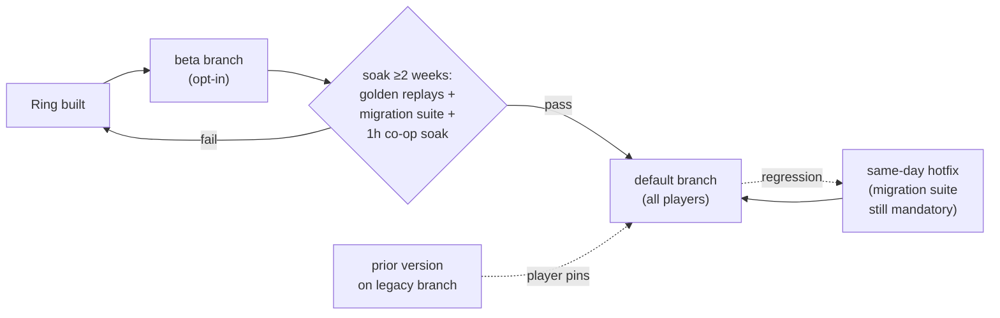

# Early Access Operations

## What it is

Early Access (EA) means selling an unfinished game on Steam while you keep building it — players pay for its **current** state. Valve is blunt: buy "based on its current state, not on promises of a future that may or may not be realized." This page treats EA as an **operations discipline**: the gate deciding when you may charge, and the cadence that keeps paying players from getting burned.

The engine will enter EA at milestone M9.5, only through a written gate — never a fixed date (master plan, M9.5). Everything below is planned policy; nothing runs yet (pre-M1).

## Why you care

EA is a one-way door. Once someone pays, the pre-EA "refuse to load an old save" escape hatch is gone: from the first paid build, every schema change ships a forward migration (master plan, M8b). A careless default-branch push can corrupt a stranger's 40-hour colony, publicly. Discipline is the difference between "rough, the way they signed up for" and "broke the thing I paid for."

Valve's rules are few but enforced: launch with a playable game, not a tech demo; make no specific promises about future content or dates; don't price higher on Steam than elsewhere.

!!! warning
    "Do not make specific promises about future events... Do not ask your customers to bet on the future of your game." A roadmap is a direction, never a dated contract — the engine's ring ladder is optional past each ring (master plan, Game ladder).

## Quick start

The M9.5 gate is a checklist, not a calendar. Every bar green, or you don't ship (master plan, M9.5; RELEASE-GATES.md):

| Gate bar | Threshold |
|---|---|
| Wishlists | ≥7k, or a written conscious-go decision |
| Crash-free sessions (Sentry) | ≥99% over a final 2-week playtest |
| Tester hours | ≥10 testers at 5+ hrs; colonies survive save/reload across two builds |
| FTUE | re-verified with cold-start testers |
| RELEASE-GATES.md | all green (p95 ≤16.6 ms on Deck; load <30 s; zero corrupted saves in kill-fuzz) |
| Comms | EA FAQ, pricing, public roadmap post drafted |

The 7k figure isn't vanity: ~7–10k is the launch-day algorithm floor (master plan, Money & marketing) — enough to reach Steam's New & Trending shelf. As Chris Zukowski puts it, "pleasing the Steam algorithm is the most important thing."

## How it works

After launch, content will ship as **rings** — each one shippable EA update, optional if the last ring's reception says stop (master plan, Game ladder). The ops policy activating at M9.5 will govern how a ring reaches players (master plan, M9.5):

- A ring soaks **≥2 weeks** on an opt-in Steam beta branch before it touches the default branch.
- Every default-branch push passes golden replays, the save-migration suite, and a 1-hour co-op soak.
- A same-day hotfix path runs from the release branch — migration suite still mandatory.
- Cadence: one substantive update every 6–10 weeks, plus a monthly dev post.

Branch mechanics themselves live in [Shipping builds](shipping-builds.md).

### Next Fest is a once-ever card

Steam Next Fest runs three times a year (Feb/June/Oct), and "titles may only participate in **ONE** Next Fest"; the game stays unreleased until the fest concludes. The plan spends this single card last, on the fest closest to launch, aimed at the wishlist gate (master plan, M9) — never early, before the store page and demo can convert visitors.

!!! tip
    Wishlists don't decay, so **earlier** helps the store page. Next Fest is the opposite: hold it, play it once, right before you flip to paid.

## Pros / Cons

| Pros | Cons |
|---|---|
| Revenue plus real playtesters early | Migration debt on every save-schema change, forever |
| Wishlists, community compound pre-1.0 | A bad default push hits paying strangers, publicly |
| Beta branch soaks changes on volunteers first | The roadmap sets expectations you're judged against |
| Rings let you stop or pivot per reception | The 6–10-week cadence is a treadmill |

## What to expect

- **M8b:** Steam page ships ($100 fee), Playtest wishlist funnel opens, RELEASE-GATES.md written (master plan, M8b).
- **M9:** Steamworks integration; GNS → Steam Sockets for free NAT traversal ([ADR-0014](../../engine/architecture/adr-0014-gns-transport.md)); Next Fest slot chosen.
- **M9.5:** the gate; ops policy activates at launch.
- **After launch:** the cadence above, until the ring ladder reaches 1.0. Throughout, the engine stays MIT-licensed ([ADR-0020](../../engine/architecture/adr-0020-mit-license-public-repo.md)) — you sell the game, not the engine.

## Go deeper

- [Shipping builds](shipping-builds.md) — the SteamPipe branch mechanics.
- [The Steam page](the-steam-page.md) — the store page Next Fest points at.
- [Save compatibility](save-compatibility.md) — the migration suite each push passes.
- [Steamworks overview](steamworks-overview.md), [What shipping costs](what-shipping-costs.md) — account, fees.
- [NAT traversal](../netcode/nat-traversal.md) — the M9 Steam Sockets swap.
- [Serialization basics](../architecture/serialization-basics.md) — the save header migrations version.
- [ADR-0021: Writes under prefpath](../../engine/architecture/adr-0021-writes-under-prefpath.md) — where saves live.

**Sources**

- Early Access (Steamworks Documentation) — https://partner.steamgames.com/doc/store/earlyaccess — accessed 2026-07-06
- Steam Next Fest (Steamworks Documentation) — https://partner.steamgames.com/doc/marketing/upcoming_events/nextfest — accessed 2026-07-06
- Chris Zukowski on picking a game release date (Game World Observer) — https://gameworldobserver.com/2024/07/10/steam-game-release-date-hype-next-fest-chris-zukowski — accessed 2026-07-06

Video: [ARK: Survival Evolved — Lessons from the Trenches of Early Access (GDC 2017)](https://www.youtube.com/watch?v=ZwsKuTMaRmg) — 61 min. Watch before drafting your roadmap; a post-mortem of promising too much and updating too fast.
