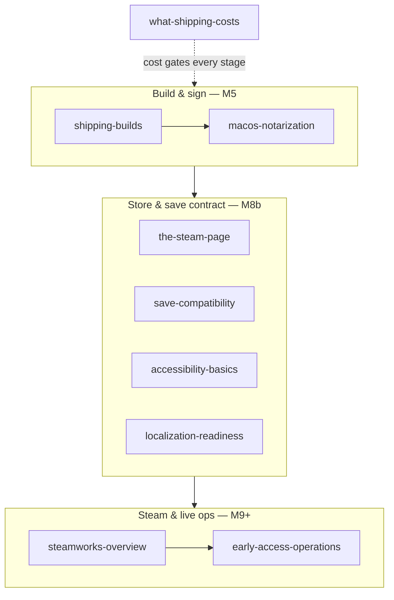

# Shipping

## What it is

This track is everything between a compiled binary and a stranger clicking **Install** — the last mile that turns the renderer, netcode, and simulation into a product on a store page. It covers Steam packaging, code signing, the store listing, save compatibility across updates, accessibility, localization, live-ops policy, and the money it all costs.

## Why you care

You can build the engine and never ship it, because the gap is not code. It is depots, notarization, a wishlist funnel, and the update discipline that keeps a live build from corrupting someone's colony. The [master plan](../../design/master-plan.md) schedules each of these — this track is the only place they connect end to end.

!!! info
    The engine is pre-M1, so every engine-specific claim here is planned tense with a link to the [master plan](../../design/master-plan.md) or an [ADR](../../engine/architecture/index.md). Packaging becomes a CI job at M5, the Steam page ships at M8b, and Steam integration lands at M9.

## How it works

Read [Shipping Builds](shipping-builds.md) first — it is the pipeline everything else hangs off. The rest arrive roughly in milestone order: build and sign at M5, store and the save contract at M8b, then Steam integration and live ops from M9.

| Page | Takeaway |
|---|---|
| [Shipping Builds](shipping-builds.md) | Depots, SteamPipe scripts, steamcmd, build IDs, and beta branches — the repeatable CI `package` job. |
| [macOS Notarization](macos-notarization.md) | Developer ID signing, hardened runtime, `notarytool`, staple — why Gatekeeper rejects unsigned builds. |
| [The Steam Page](the-steam-page.md) | Capsules, tags, screenshots, non-decaying wishlists — the game's most important marketing asset. |
| [Save Compatibility](save-compatibility.md) | A versioned header and forward migrations checked against golden fixtures — saves as a contract. |
| [Accessibility Basics](accessibility-basics.md) | Subtitles, text scaling, no color-alone, motion toggle, remappable input — cheap early, dear later. |
| [Localization Readiness](localization-readiness.md) | `tr("key")` tables, UTF-8, text that survives German expansion — translatable without translating yet. |
| [Steamworks Overview](steamworks-overview.md) | AppID, callbacks, achievements, overlay, Cloud, Steam Sockets — optional per-feature, not all-or-nothing. |
| [Early Access Operations](early-access-operations.md) | Valve's EA rules, the M9.5 launch gate, beta-branch ring soak, one update per 6–10 weeks. |
| [What Shipping Costs](what-shipping-costs.md) | The ~£1.5–3k lifetime pre-launch table plus UK Ltd, tax credit, and W-8BEN. |

## What to expect

About an evening per page. Pages land in batches as they clear the same verify pass as every other track; start with the two that are ready and follow the flow above.

## Go deeper

Start with [Shipping Builds](shipping-builds.md). The tracks it leans on: [C++ for Game Devs](../cpp/index.md) for the build and [Engine Architecture](../architecture/index.md) for the save format it delivers. The planned M9 transport swap to Steam Sockets sits behind the interface set in [ADR-0014](../../engine/architecture/adr-0014-gns-transport.md).

Sources:

- Steamworks Documentation — https://partner.steamgames.com/doc/home — accessed 2026-07-06
- Chris Zukowski, How To Market A Game — https://howtomarketagame.com/ — accessed 2026-07-06
- Game Accessibility Guidelines — https://gameaccessibilityguidelines.com/ — accessed 2026-07-06
