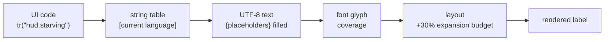

# Localization Readiness

## What it is

Two different jobs share a confusing pair of names. **Internationalization** (i18n) is the engineering that makes a game **translatable**: text lives in data not code, encoding is Unicode, layouts stretch. **Localization** (l10n) is the later, paid act of translating into a specific language. This page is entirely about the first. The plan is to be **ready** to localize while shipping English-only, so that turning on Chinese, German, or French later is a content job, not a rewrite.

The engine is pre-M1, so this is planned. Every player-facing string will go through a `tr("key")` string-table lookup from the first UI text at **M8b** ([master plan](../../design/master-plan.md), productization; [ADR-0022](../../engine/architecture/adr-0022-imgui-slice-ui.md)).

## Why you care

Retrofitting is the expensive path. If strings are baked into C++ literals, adding a language means grepping the whole codebase, and you **will** miss some — a truncated button here, an untranslated tooltip there. "Be ready from the start" is the first rule of game localization for exactly this reason: internationalize during development, never at launch.

It also keeps a real option open. Colony sims over-index in Chinese, German, and French markets (master plan), so the M9 choice of whether to fund translation is worth preserving — and that option only exists if the build was made ready first.

## Quick start

The one rule: **no string the player reads is a literal in code.** Each is a stable key into a string table.

```cpp
#include <string>
#include <string_view>
#include <unordered_map>

// A string table maps a stable key to display text for one language.
// A miss returns the key itself, so a gap is loud on screen instead
// of rendering as empty text you might never notice.
class StringTable {
    std::unordered_map<std::string, std::string> entries_;
public:
    void set(std::string key, std::string text) {
        entries_.emplace(std::move(key), std::move(text));
    }
    std::string_view tr(std::string_view key) const {
        auto it = entries_.find(std::string{key});
        return it != entries_.end() ? std::string_view{it->second}
                                    : key;
    }
};

int main() {
    StringTable en;
    en.set("hud.starving", "Starving");
    return en.tr("hud.starving") == "Starving" ? 0 : 1;
}
```

The key `hud.starving`, never the English words, appears in code. The table is authored data — UTF-8 JSON, one file per language:

```json
{
  "hud.starving": "Starving",
  "alert.raid": "{count} raiders approaching {settlement}"
}
```

Variables go in **placeholders**, never string concatenation. `"{count} raiders approaching"` lets a translator reorder the whole sentence; `"raiders approaching: " + n` welds English word order onto every language and breaks the moment German wants the number last.

## How it works

A rendered label is the end of a short pipeline, and each stage is a readiness requirement.



- **Keys, not words** — code will reference `hud.starving` and saves will store the key, not display text ([ADR-0022](../../engine/architecture/adr-0022-imgui-slice-ui.md)); swapping the table swaps the language with no code change.
- **One table format, UTF-8 throughout** — the source files, loader, and wire are planned UTF-8 end to end so accented and CJK characters survive untouched. Accents carry meaning: French "dès" (as soon as) is not "des" (of the).
- **Placeholders, not concatenation** — grammar and word order differ per language, so only whole, parameterized sentences translate cleanly.
- **Font coverage** — the glyphs must actually exist. The plan is OFL fonts only (master plan, cost table: fonts £0), picked for real coverage of the target languages; a font missing CJK renders tofu boxes, not text.
- **Expansion budget** — German and French run up to ~30% longer than English, so buttons and panels must grow with their text, never clip it.

## Pros / Cons

| Pros | Cons |
|---|---|
| Adding a language is a data drop, no code change | Every UI string must be authored as a key from day one |
| Missing strings surface loudly as visible keys | Discipline is manual — one hardcoded literal slips the net |
| Placeholders let translators reorder sentences | Placeholder order and plural rules need care per language |
| UTF-8 + OFL fonts cover CJK without re-engineering | Font files with full coverage are larger than ASCII-only |

## What to expect

**Pseudo-localization is the test, and it needs zero translators.** A build step rewrites every table entry into an accented, padded, bracket-wrapped form — `Starving` becomes `[Šŧàŕvíñg~~~~~]`. Run the game and read the screen: a clipped bracket edge means a layout that will cut off real translations; a missing accent means a font gap; any plain-English word still showing is a hardcoded string the `tr()` net missed. It is the cheapest honest proof that the game is translatable, and it fits inside CI.

All of this lands during M8b productization (planned). The decision itself waits for **M9**: state English-only on the Steam page, or budget zh-CN/de/fr translation (master plan, decide by M9). The money behind that call, and translating the store listing rather than the game, are separate pages below.

## Go deeper

- [The Steam page](the-steam-page.md) — translating the store listing itself, a different job from the game text
- [Accessibility basics](accessibility-basics.md) — text scaling, subtitles, and font-size options for the same UI
- [What shipping costs](what-shipping-costs.md) — the localization budget line and the M9 decision economics
- [Save compatibility](save-compatibility.md) — why saves store keys, not display text, across shipped builds
- [Serialization basics](../architecture/serialization-basics.md) — string tables as authored JSON, versioned like other content
- [Core containers](../cpp/core-containers.md) — the `unordered_map` and `string_view` this lookup is built from
- ADR: [0022 ImGui slice UI](../../engine/architecture/adr-0022-imgui-slice-ui.md) — where `tr("key")` tables and OFL-only fonts are decided

Sources:

- Localization and Languages — Steamworks Documentation — https://partner.steamgames.com/doc/store/localization — accessed 2026-07-06
- 9 Game Localization Best Practices — Game Developer — https://www.gamedeveloper.com/production/9-game-localization-best-practices — accessed 2026-07-06
