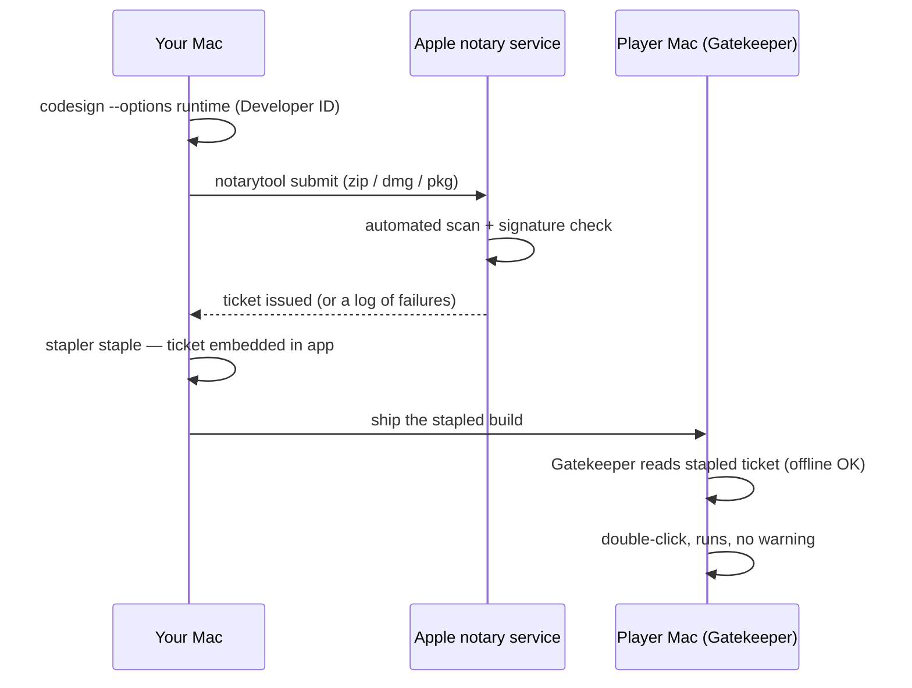

# macOS Notarization

## What it is

Notarization is Apple's automated malware scan for software shipped outside the Mac App Store. You sign your app with a **Developer ID** certificate, upload it to Apple's notary service, and it scans the binary — if clean, it issues a cryptographic **ticket**. You **staple** that ticket onto the app so any Mac trusts it, online or off. It is not App Review: no human looks at your game, and the turnaround is usually minutes, not days.

## Why you care

Handing a friend an unsigned `.zip` used to mean "right-click, Open, click through the scary dialog." macOS **Sequoia** (15) killed that shortcut: Gatekeeper no longer honours the Control-click bypass, and the only override is buried in System Settings › Privacy & Security. Half your playtesters never find it; the rest assume your build is broken.

The engine will hit this at **M5** — the first build handed to friends over the internet (master plan, M5). That milestone budgets an Apple Developer Program membership ($99/yr) for exactly this reason: unsigned macOS builds stopped working for remote testers. Windows needs no equivalent cert — shipping through Steam avoids the SmartScreen friction (reputation accrues from launching via the trusted Steam client), so no separate code-signing cert is required — a Mac-only cost (master plan, cost table).

## Quick start

Five commands per build, from a Mac with your Developer ID certificate installed:

```bash
# fragment — does not compile alone (shell; run once per build)
# one-time: cache your credentials in the keychain
xcrun notarytool store-credentials "notary" \
  --apple-id "you@example.com" --team-id "ABCDE12345" \
  --password "app-specific-password"

# 1. sign with the hardened runtime + a secure timestamp
codesign --force --options runtime --timestamp \
  --sign "Developer ID Application: Your Name (ABCDE12345)" ColonyGame.app

# 2. zip, submit, and block until Apple answers
ditto -c -k --keepParent ColonyGame.app ColonyGame.zip
xcrun notarytool submit ColonyGame.zip --keychain-profile "notary" --wait

# 3. staple the ticket so it works offline, then verify
xcrun stapler staple ColonyGame.app
spctl -a -vvv --type execute ColonyGame.app
```

`notarytool` replaced the old `altool`, which Apple decommissioned in November 2023 — ignore any tutorial that still uses it.

## How it works

The round-trip is a conversation between three machines: yours, Apple's, and the player's.



Three parts do the work. The **Developer ID Application** certificate proves the build came from your enrolled account. The **hardened runtime** (`--options runtime`) opts your process into Apple's anti-tamper protections — a prerequisite the notary service enforces. The **staple** copies the ticket into the bundle, so Gatekeeper validates it without phoning home. Skip stapling and a first launch offline fails.

!!! warning
    Hardened runtime blocks unsigned dynamic libraries, injected code, and JIT. If the engine ever enables Luau native codegen (ADR-0015), that binary will need the `com.apple.security.cs.allow-jit` entitlement, and every bundled `.dylib` must be signed inside-out — nested code first, the app last.

## Pros / Cons

| Pros | Cons |
|---|---|
| Friends get a clean double-click | $99/yr membership, indefinitely |
| Stapled ticket works offline | Every new build re-notarized |
| Automated, minutes not days | Hardened runtime breaks unsigned dylibs / JIT |
| No human review of your content | Mac-only chore; adds a CI step |

## What to expect

At M5 you will run these commands by hand for a handful of friend builds; wiring them into the `package` CI job comes later, once the flow is boring. Submissions usually clear in under an hour — often two minutes — but a failed scan returns a log you must read, fix, then resubmit. There is no partial credit: one unsigned helper binary fails the whole submission.

Notarization says nothing about where your game may write — saves, logs, and mods will live under the pref-path, never beside the signed bundle (ADR-0021). It is also orthogonal to Steam: depot builds take their own path (shipping-builds).

## Go deeper

- **[Packaging & Steam depot upload](shipping-builds.md)** — the build this page signs, and how it reaches players.
- **[What shipping costs](what-shipping-costs.md)** — the $99/yr fee in the full running-cost picture.
- **[CMake: the minimum](../cpp/cmake-minimum.md)** — the build that produces the `.app` bundle you sign.
- **[ADR-0021: writes under pref-path](../../engine/architecture/adr-0021-writes-under-prefpath.md)** — why a signed app never writes beside itself.
- **[ADR-0015: Luau modding](../../engine/architecture/adr-0015-luau-modding.md)** — the JIT entitlement caveat above.

Sources:

- Notarizing macOS software before distribution — https://developer.apple.com/documentation/security/notarizing-macos-software-before-distribution — accessed 2026-07-06
- Customizing the notarization workflow — https://developer.apple.com/documentation/security/customizing-the-notarization-workflow — accessed 2026-07-06

Video: "All About Notarization" (WWDC19, session 703) — 33 min — watch after the Quick start when a submission fails and you need a mental model of what the notary service actually checks.
