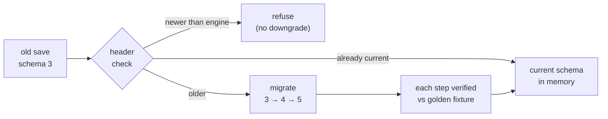

# Save Compatibility

## What it is

Save compatibility is the promise that a colony saved in one build still opens in the next. The engine will stamp every save with a versioned **header** — engine version, mod-API level, the mod list with content hashes, and the sim tick — and read that header before touching the body ([roadmap M8b](../../engine/roadmap.md)). The header decides one of three outcomes: load as-is, run the save forward through migrations to the current schema, or refuse. How the bytes themselves are written is [Serialization basics](../architecture/serialization-basics.md); this page is only about surviving format change across shipped versions.

## Why you care

A save is throwaway until money changes hands; after that it is a contract. Pre-Early-Access the engine will simply **refuse** to load a save from an older schema — cheap, honest, and fine while the only player is you ([master plan, M8b](../../design/master-plan.md)). From the first paid EA build that flips: every schema change must ship a **forward migration**, because someone's 40-hour colony is now on the line. Break that promise once and the store reviews remember it forever. This is why the plan freezes golden-fixture saves per schema version in the repo, forever ([master plan, Save/load](../../design/master-plan.md)).

## Quick start

The header is small, self-describing, and read first:

```json
{
  "format": "colony-save",
  "schema": 5,
  "engine_version": "1.4.2",
  "api_level": 5,
  "tick": 184203,
  "mods": [
    { "id": "base-colony",     "hash": "sha256:9f2c…" },
    { "id": "friends-raiders", "hash": "sha256:1a08…" }
  ]
}
```

`schema` picks the migration path. `api_level` and the mod `hash`es tell a loader whether the mods that authored this world are present and identical — the same manifest/hash match the mod loader (M6) and join handshake (M3) will use ([master plan](../../design/master-plan.md)). `tick` is the world clock the sim resumes from.

## How it works

Loading is a pipeline, not a single read. The header check will compare the save's `schema` to the engine's. Equal: load. Older: walk the **migration chain**, one small step per version, until the in-memory shape matches today's. Newer: refuse — a save from a future build cannot be trusted to a past one, exactly as Factorio warns that "save games cannot be downgraded."



Each step is written test-first against a **golden fixture** — a real save frozen at that schema version — so the chain is proven on every push, not hoped at ship ([master plan, M8b](../../design/master-plan.md)). Breaking updates that can't migrate cleanly ship on an opt-in beta branch with the prior build kept as a **legacy branch**; that release policy lives in [Early Access operations](./early-access-operations.md).

Writing is the other half of the contract: a crash mid-save must never eat the live file. The engine will write a sibling temp file, then rename it over the target — a rename is atomic on one filesystem, so the save is either wholly old or wholly new, never half:

```cpp
#include <cassert>
#include <filesystem>
#include <fstream>
#include <iterator>
#include <string>

namespace fs = std::filesystem;

// ponytail: real code also fsyncs the file + its dir before rename; elided here.
bool save_atomic(const fs::path& target, const std::string& bytes) {
    fs::path tmp = target;
    tmp += ".tmp";
    {
        std::ofstream out(tmp, std::ios::binary | std::ios::trunc);
        out << bytes;
        if (!out) return false;             // disk full / write error: keep old save
    }
    std::error_code ec;
    fs::rename(tmp, target, ec);            // atomic on the same filesystem
    return !ec;
}

int main() {
    fs::path save = fs::temp_directory_path() / "colony.sav";
    assert(save_atomic(save, "SAVEv5…"));

    std::ifstream in(save, std::ios::binary);
    std::string got((std::istreambuf_iterator<char>(in)),
                    std::istreambuf_iterator<char>());
    assert(got == "SAVEv5…");
    fs::remove(save);
}
```

Rolling backups keep the last few saves, and a **100-run kill-the-process-during-save** fuzz test asserts zero corruption before a build may ship ([master plan, M8b](../../design/master-plan.md)). All of it will land under `SDL_GetPrefPath`, never beside the executable, so Steam's own depot verification can't overwrite a save ([ADR-0021](../../engine/architecture/adr-0021-writes-under-prefpath.md)).

!!! warning
    No-downgrade is a feature, not a gap. Feeding a newer save to an older engine risks silent corruption; refusing is the honest failure. Tell the player to update — and keep a backup.

!!! info
    Migrations only move a save forward. There is no reverse migration: the legacy branch, not a downgrade path, is how a player stays on an old version.

## Pros / Cons

- **Pro:** one header read decides load / migrate / refuse before any risky parsing.
- **Pro:** golden fixtures prove every migration on every push, not at ship.
- **Pro:** temp-rename plus rolling backups make a mid-save crash non-destructive.
- **Con:** every schema change is migration work that never amortizes.
- **Con:** golden fixtures live in the repo forever, one per version, growing without bound.
- **Con:** no-downgrade means a player who opts into the beta branch can't easily go back.

## What to expect

None of this exists yet — versioned saves, the migration policy, and the kill-during-save fuzz all land at M8b, the productization milestone ([roadmap](../../engine/roadmap.md)). Day to day the work is unglamorous: most schema changes are one added field and a two-line migration, most loads hit the equal-version fast path, and the fixture suite catches the one migration in twenty that gets it wrong. The discipline is front-loaded — the header ships from the first save file, the way the JSON `version` field does — so that the day money is involved, the machinery is already there.

## Go deeper

- [Early Access operations](./early-access-operations.md) — the beta/legacy branch release policy this page assumes.
- [Steamworks overview](./steamworks-overview.md) — Steam Cloud sync, sized to the rolling-backup save set.
- [Serialization basics](../architecture/serialization-basics.md) — the one `Serialize` template that writes the bytes a header wraps.
- [Versioning a mod API](../scripting/api-versioning.md) — the API-level side of the same header; where migrations meet mods.
- [ADR-0021: writes go under SDL_GetPrefPath](../../engine/architecture/adr-0021-writes-under-prefpath.md) — where saves and backups live.
- [ADR-0013: JSON-authored, bitstream wire](../../engine/architecture/adr-0013-json-authored-bitstream-wire.md) — the serialization format the header wraps.

**Sources**

- Friday Facts #270 — HR Substation & Save/Load overview — https://factorio.com/blog/post/fff-270 — accessed 2026-07-06
- Friday Facts #444 — 2.1 Experimental release (no-downgrade of saves) — https://factorio.com/blog/post/fff-444 — accessed 2026-07-06
