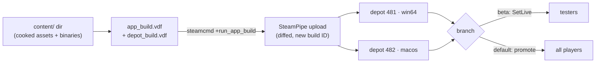

# Shipping Builds

## What it is

A compiled binary is not a product. **Shipping a build** means turning the executable your compiler produced into something Steam can install on a stranger's machine, on both operating systems you target. Steam's delivery system is **SteamPipe**, and its vocabulary is small: a **depot** is a logical group of files, a **build** is one uploaded snapshot of those depots identified by a **build ID**, and a **branch** is a named pointer deciding which build a given player downloads.

You describe the upload with two small config files in Valve's **VDF** (KeyValues) format — an app-build script, plus one depot-build script per depot — then hand them to the `steamcmd` command-line tool, which diffs your content against the last upload and pushes only what changed.

SteamPipe exists today; the engine feeding it does not. It is pre-M1, so treat every engine step below as planned: builds become a repeatable CI `package` job at **M5** (master plan, milestone roadmap), before the Steam page ships at **M8b-start** ([the-steam-page](the-steam-page.md)).

## Why you care

Coming from Python or JavaScript, you expect `npm publish` to hand a finished artifact to a registry in one line. Steam is lower-level: you lay out a content directory exactly as it should appear on disk, declare which files belong to which depot, and which depot mounts on which OS. Get it wrong and a Windows player downloads macOS binaries, or a save is clobbered — which is why the engine will write every save under the OS pref-path, never beside the executable Steam owns (ADR-0021).

Doing this by hand once teaches the shape; doing it every release is the mistake M5's `package` job exists to prevent.

## Quick start

Lay out a content directory, one subfolder per OS:

```text
content/
├── win64/    game.exe, *.dll, assets/
└── macos/    Game.app/
```

The app-build script names the app, points at that directory, and lists depots:

```
// fragment — does not compile alone
"AppBuild"
{
  "AppID"       "480"
  "Desc"        "colony 0.1.0"
  "ContentRoot" "../content/"
  "Depots"
  {
    "481"  "depot_win64.vdf"
    "482"  "depot_macos.vdf"
  }
}
```

Each depot-build script maps files into the depot; the depot's OS restriction — set on the depot so Steam mounts it "only on systems of given OS" (depots doc) — is what keeps 481 off Macs:

```
// fragment — does not compile alone
"DepotBuild"
{
  "DepotID" "481"
  "FileMapping" { "LocalPath" "win64\*" "DepotPath" "." }
}
```

Then upload:

```sh
steamcmd +login <account> +run_app_build ../scripts/app_build.vdf +quit
```

steamcmd uploads a new build with a fresh build ID, visible in App Admin. It is not live yet: set it live on a **beta branch** to test, then promote it to **default** — the branch every customer downloads — from App Admin.

!!! warning
    steamcmd uploads only a *diff* against the previous build, so the content directory must be complete every time. A file you forget to copy in is a file Steam deletes from the depot. Build `content/` from a clean checkout, never by hand-editing last release's folder.

## How it works



The content directory is the single source of truth. Before Steam, the engine will run its **asset cooker** (`tools/cooker/`, arriving pre-Steam) over source assets to produce KTX2 textures and packed archives; that cooked output is what lands in `content/`, while modders keep loading raw source formats at runtime (master plan, stack table). steamcmd then uploads only the chunks whose hashes changed, yielding a new immutable build ID.

Branches separate testers from customers. A build set live on a beta branch reaches only players who opted into it; default reaches everyone else. That split is also how breaking changes ship safely once the game is live — the branch policy governing Early Access updates is its own page ([early-access-operations](early-access-operations.md)). At M9 the transport changes too, as GNS swaps to Steam Sockets for friend invites (ADR-0014), but that is Steamworks integration, not the build pipeline.

## Pros / Cons

**Pros:** diffed uploads make every release after the first cheap; per-OS depots let one app serve Windows plus macOS; branches give a free staging channel; the whole flow scripts cleanly into CI.

**Cons:** the VDF layout is fiddly and unforgiving of a missing file; a bad default promotion has no rollback except uploading again; and none of it signs your macOS binary, so Gatekeeper still blocks an unsigned app ([macos-notarization](macos-notarization.md)).

## What to expect

The first upload is slow — Steam hashes and uploads the full set — and every upload after is a fast delta. Expect your first session fighting the content-directory layout and OS settings, not the tooling. From M5 the master plan folds all of it into the CI `package` job, so by launch "ship a build" is a green pipeline, not a checklist run from memory. The \$100 Steamworks fee and the pre-launch cost table live in [what-shipping-costs](what-shipping-costs.md).

## Go deeper

- [Steamworks overview](steamworks-overview.md) — the SDK and appIDs this pipeline feeds
- [macOS notarization](macos-notarization.md) — signing the bundle Gatekeeper demands
- [Early-access operations](early-access-operations.md) — branch policy for live updates
- [What shipping costs](what-shipping-costs.md) — the \$100 fee and the cost table
- [CMake: the minimum](../cpp/cmake-minimum.md) — where the binaries in `content/` come from
- [Serialization basics](../architecture/serialization-basics.md) — the save format that must survive across shipped builds
- ADRs: [0021 pref-path writes](../../engine/architecture/adr-0021-writes-under-prefpath.md) · [0014 GNS transport](../../engine/architecture/adr-0014-gns-transport.md) · [0020 MIT license](../../engine/architecture/adr-0020-mit-license-public-repo.md)

Sources:

- Uploading to Steam — Steamworks Documentation — https://partner.steamgames.com/doc/sdk/uploading — accessed 2026-07-06
- Depots — Steamworks Documentation — https://partner.steamgames.com/doc/store/application/depots — accessed 2026-07-06

Video: "Steamworks Tutorial #1 — Building Your Content in Steampipe" (Valve) — https://www.youtube.com/watch?v=SoNH-v6aU9Q — 12 min — watch before your first upload to see the app-build and depot-build scripts and the steamcmd run end to end.
