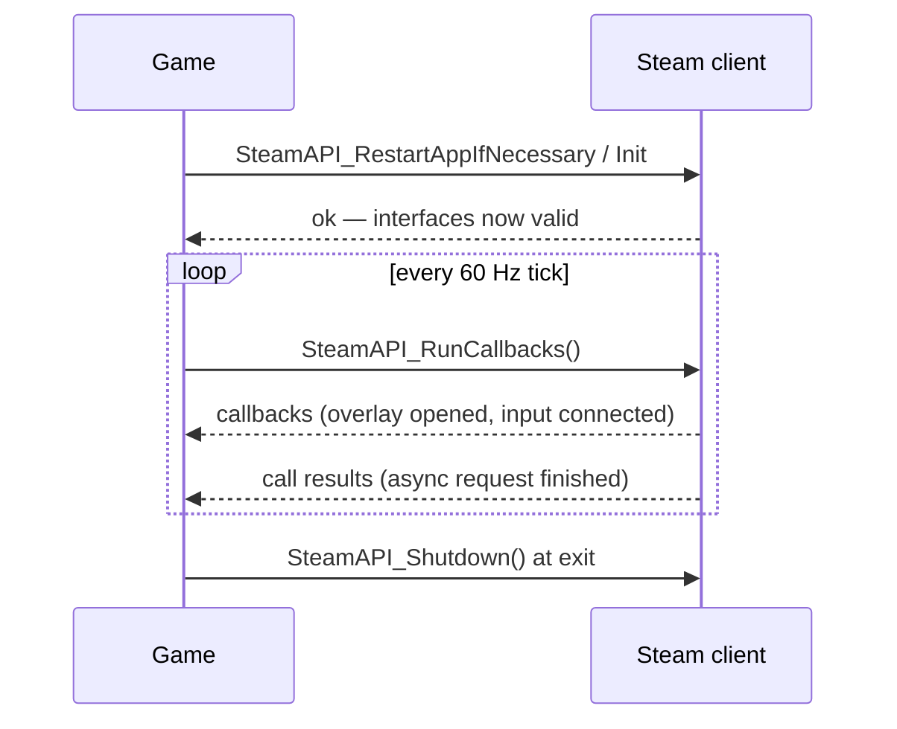

# Steamworks Overview

## What it is

The Steamworks SDK is a C++ library your game links against to talk to the Steam client running on the same machine. It is not one monolithic "Steam integration" — it is a **menu of independent feature interfaces**, each reached through one accessor: `SteamUserStats()` for achievements and stats, `SteamFriends()` for the overlay, `SteamInput()` for controllers, `SteamRemoteStorage()` for Steam Cloud, `SteamNetworkingSockets()` for peer connections.

Every interface sits behind a single gate: `SteamAPI_Init()` must succeed before any of them work, and you must pump `SteamAPI_RunCallbacks()` regularly so the library can hand events back to you. Past that, you adopt features **à la carte** — achievements without cloud, cloud without networking.

## Why you care

Your revenue model is game sales on Steam; the engine itself stays MIT and free ([ADR-0020](../../engine/architecture/adr-0020-mit-license-public-repo.md)). So Steam is the shipping target, and a few of these interfaces buy real capability for almost no code:

- **Steam Sockets + Steam Datagram Relay** solve player-hosted NAT traversal, encryption, and DDoS shielding for free — the whole reason the netcode will build on GNS ([ADR-0014](../../engine/architecture/adr-0014-gns-transport.md)).
- **Steam Cloud** backs saves up off the player's disk with no server of your own.
- **SteamID64** is a ready-made, globally unique `PlayerId`; the command funnel's design reserves an opaque slot for it ([ADR-0004](../../engine/architecture/adr-0004-one-command-funnel.md)).
- Overlay, achievements, and controller support are each a few calls, not a subsystem.

None of it exists yet — the engine is pre-M1. The plan is to adopt a chosen subset at M9 ([master plan](../../design/master-plan.md), M9 Steam integration), never all of it at once.

## Quick start

Development needs the target's numeric App ID. The file `steam_appid.txt`, placed next to the executable, holds only that number:

```text
480
```

This is a development-only shim — ship it and the build talks to the wrong app. With it in place the lifecycle is: init once, pump every tick, shut down at exit.

```cpp
// fragment — does not compile alone (needs the Steamworks SDK: steam_api.h)
if (SteamAPI_RestartAppIfNecessary(k_appId)) return 1;  // relaunch via Steam
if (!SteamAPI_Init()) return 1;                          // the gate for everything

while (running) {
    SteamAPI_RunCallbacks();   // deliver overlay/cloud/net events — once per tick
    tick();                    // your 60 Hz simulation step
}

SteamAPI_Shutdown();
```

That pump is the only Steamworks call that belongs in the hot loop, and the engine's planned fixed 60 Hz tick ([ADR-0002](../../engine/architecture/adr-0002-fixed-60hz-tick.md)) matches the "once per frame" cadence Valve asks for.

## How it works

Two mechanisms carry data back from Steam. **Callbacks** broadcast events you did not request — the player opened the overlay (`GameOverlayActivated_t`), a controller connected. **Call results** answer one specific async request you made, delivered to a `CCallResult` you registered. Both fire only while `SteamAPI_RunCallbacks()` is executing, which is why the pump is non-negotiable.



The engine's planned adoption keeps each feature behind a seam, the way GNS types never leave `engine/net/`:

- **Networking:** the transport interface will swap its GNS backend for Steam Sockets at M9 ([ADR-0014](../../engine/architecture/adr-0014-gns-transport.md)); nothing above the ~6-function seam notices, and SDR appears underneath.
- **Steam Cloud:** enabled at M9, sized to the rolling-backup save set ([master plan](../../design/master-plan.md), M9). Two options — **Auto-Cloud** (path patterns configured on the Steamworks site, zero code) or the `ISteamRemoteStorage` file API. Either points at `SDL_GetPrefPath`, never beside the executable, because Steam owns and can overwrite its own depot ([ADR-0021](../../engine/architecture/adr-0021-writes-under-prefpath.md)). One write caps at 100 MB.

!!! warning
    `steam_appid.txt` overrides the App ID Steam would otherwise provide, so it is a development-only convenience — ship it and a player's build talks to the wrong app. It also means you cannot exercise most interfaces until an App ID exists, which costs the $100 Steam Direct fee at M8b-start ([master plan](../../design/master-plan.md), M8b milestone).

## Pros / Cons

| Pros | Cons |
| --- | --- |
| Per-feature opt-in — adopt any subset | Each adopted feature assumes Steam is installed and running |
| SDR gives free NAT traversal, encryption, DDoS shielding | C-style callback API needs quarantining behind a seam |
| Cloud saves and overlay for near-zero code | Most interfaces are untestable until the App ID is bought |
| SteamID64 is a ready-made global PlayerId | Auto-Cloud conflicts if you sync machine-specific settings |

## What to expect

Before M9 you develop with none of this: the transport runs on loopback or plain GNS ([ADR-0014](../../engine/architecture/adr-0014-gns-transport.md)), saves are local, `PlayerId` is a throwaway GUID. The Steam page and App ID arrive first, at M8b-start ([master plan](../../design/master-plan.md), Money & marketing). M9 is then the integration pass — the Steam Sockets swap, Cloud enabled, the Steam Input decision — each a bounded change rather than a rewrite, because the seams were drawn for it. It all gates the M9.5 Early Access launch.

## Go deeper

- [Shipping builds with SteamPipe](./shipping-builds.md) — uploading depots and promoting branches (this page stops at the SDK)
- [The Steam page](./the-steam-page.md) — store assets, wishlists, the Playtest funnel
- [macOS notarization](./macos-notarization.md) — the other platform gate before you can ship
- [Save compatibility](./save-compatibility.md) — the save set Steam Cloud syncs
- [What shipping costs](./what-shipping-costs.md) — the Steam Direct fee and tax setup
- [NAT traversal](../netcode/nat-traversal.md) — what Steam Sockets + SDR actually solve
- [Serialization basics](../architecture/serialization-basics.md) — the save bytes Cloud carries
- [CMake: the minimum](../cpp/cmake-minimum.md) — how the SDK would enter the build
- [ADR-0014](../../engine/architecture/adr-0014-gns-transport.md) — GNS → Steam Sockets behind the transport seam
- [ADR-0021](../../engine/architecture/adr-0021-writes-under-prefpath.md) — why saves live under pref-path, not the depot

**Sources**

- Steamworks API Overview — https://partner.steamgames.com/doc/sdk/api — accessed 2026-07-06
- Steam Cloud — https://partner.steamgames.com/doc/features/cloud — accessed 2026-07-06
- Steamworks Documentation (home) — https://partner.steamgames.com/doc/home — accessed 2026-07-06
