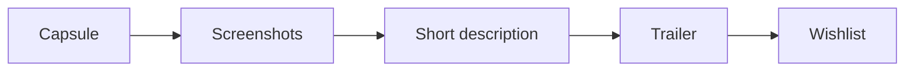
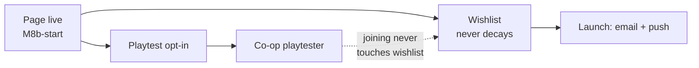

# The Steam Page

## What it is

The Steam store page is the single public URL where a shopper decides, in seconds, whether to click **Add to Wishlist**. It is assembled from a small set of parts: a **capsule** (the thumbnail that carries the game across Steam), a short description, one genre plus a few tags, screenshots, and a trailer. Chris Zukowski calls it the most important marketing asset a game has — every other channel, from a devlog to a fest, ultimately points here.

For this engine's game the page is planned, not built: it will ship at **M8b-start**, once a trademark search clears the name ([master plan](../../design/master-plan.md), Money & marketing). The engine is pre-M1 — nothing is built yet. Selling on Steam is the whole revenue model: the engine is MIT and free, the game is not ([ADR-0020](../../engine/architecture/adr-0020-mit-license-public-repo.md)).

## Why you care

One word: **wishlists**. When the game releases, every user who has it wishlisted gets an email and/or a mobile push ([Steamworks](https://partner.steamgames.com/doc/marketing/wishlist)) — a launch-day audience you bank for free, for the page's whole life.

And wishlists **never decay**. Steam's docs describe no expiry, and Zukowski is blunt about the myth that early wishlists convert worse: "wishlists really don't age. They aren't bread." The only thing that spoils them is changing the game out from under the people who wishlisted it — a genre or art-style pivot after the fact. So publishing early is pure upside, which is why the master plan puts the page at M8b-start, not near launch.

!!! warning "Clear the name first"
    Publishing brands the game publicly, so the page is gated behind a trademark search (UK IPO / EUIPO / USPTO / Steam / domains). Renaming after wishlists accrue throws them away — the repo is still literally called "game-engine" today.

## Quick start

The minimum viable page to publish at M8b-start:

- **Capsule** — professionally designed. Zukowski: the one asset you cannot fake.
- **One genre**, held consistently — pick it and don't drift; the tags reinforce it.
- **Three-plus screenshots** from distinct areas, so the page isn't read as an asset flip.
- **Short description** — a couple of sentences a stranger grasps cold.
- **Trailer** — in-game footage in the first seconds, never a CGI cutscene.
- **Steam Playtest** attached, to convert wishlists into playtesters (below).

## How it works

**Shoppers read screenshots before the trailer.** The eye lands on the capsule, scans the screenshots, skims the description, and only presses play if those sold it. Optimize in that order:

Valve's spec fixes the pixel dimensions (August 2024 templates; older sizes are rejected):

| Asset | Size (px) |
| --- | --- |
| Header capsule | 920 × 430 |
| Small capsule | 462 × 174 |
| Main capsule | 1232 × 706 |
| Vertical capsule | 748 × 896 |
| Screenshots | ≥ 1920 × 1080, 16:9 |

Capsules carry "just your game logo and artwork" — no review scores, award laurels, or discount stickers.

### The wishlist-to-playtester funnel

Steam Playtest is a free, separate child app that appears as a button on the main page. Players request access there, and joining or leaving never touches their wishlist ([Steamworks](https://partner.steamgames.com/doc/features/playtest)). The master plan wires it as the co-op playtest channel, so the page that banks wishlists also recruits testers for the standing fortnightly session.

## Pros / Cons

| Pros | Cons |
| --- | --- |
| Free; wishlists compound for the page's life | Needs a polished capsule ([what-shipping-costs](./what-shipping-costs.md)) |
| Launch-day email + push to every wishlister | Locks in the name — trademark first |
| Playtest recruits testers without a second page | Genre or art pivots forfeit wishlists |
| No downside to early — wishlists don't decay | A live page invites scrutiny early |

## What to expect

At M8b-start the sequence is: clear the trademark search, publish the Coming Soon page ($100 Steam fee, [master plan](../../design/master-plan.md), Money & marketing), attach Steam Playtest, then feed it from the devlog and mailing list. Wishlists bank from that day to launch.

This page stops at the store page itself. The launch-day wishlist gate and Next Fest's once-per-game timing live in [early-access-operations](./early-access-operations.md); the capsule-art budget in [what-shipping-costs](./what-shipping-costs.md); translating the copy in [localization-readiness](./localization-readiness.md).

## Go deeper

- [Steamworks overview](./steamworks-overview.md) — the SDK the page sits on
- [Shipping builds](./shipping-builds.md) — the depot the page will sell
- [Early-access operations](./early-access-operations.md) — the wishlist launch gate, Next Fest timing
- [What shipping costs](./what-shipping-costs.md) — the $100 fee, capsule-art budget
- [Localization readiness](./localization-readiness.md) — translating the page's copy
- [Serialization basics](../architecture/serialization-basics.md) — the save format behind any cross-save promise
- [CMake minimum](../cpp/cmake-minimum.md) — the build that becomes the depot
- [ADR-0020](../../engine/architecture/adr-0020-mit-license-public-repo.md) — revenue is Steam sales, not the MIT engine

**Sources**

- Graphical Assets — Overview (Steamworks Documentation) — https://partner.steamgames.com/doc/store/assets — accessed 2026-07-06
- Wishlists (Steamworks Documentation) — https://partner.steamgames.com/doc/marketing/wishlist — accessed 2026-07-06
- What devs should do before launching a Steam page (Game World Observer, on Chris Zukowski's guidance) — https://gameworldobserver.com/2025/03/11/steam-page-launch-guide-wishlists-zukowski — accessed 2026-07-06
- Steam Playtest (Steamworks Documentation) — https://partner.steamgames.com/doc/features/playtest — accessed 2026-07-06

**Video** — [Steam EXPERT explains How To Make a GREAT Steam page!](https://www.youtube.com/watch?v=XG4tAGVAlBQ) (Chris Zukowski on Code Monkey, 78 min). Watch when you are assembling the capsule and screenshots; it dissects real store pages element by element.
