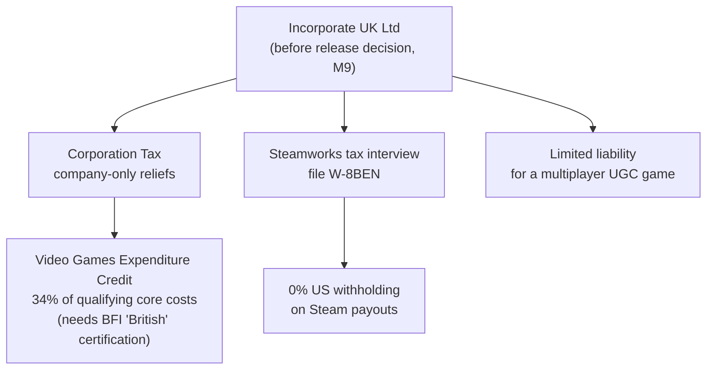

# What Shipping Costs

## What it is

The written-down money reality of putting this game on Steam: a planned lifetime pre-launch spend of about **£1.5–3k**, plus the business layer beneath it — a UK limited company, the Video Games Expenditure Credit, and one tax form that zeroes US withholding. The engine is pre-M1, so this is planned; figures come from the [master plan](../../design/master-plan.md) cost table ("Money & marketing") in its currency, landing at specific milestones, not on day one.

A costs-**as-decisions** page, not a bookkeeping tutorial — how each purchase is used lives in the sibling pages.

## Why you care

For a solo, part-time build the master plan is blunt: burnout, not technology, is the likely killer, and surprise spend feeds it. Writing every cost down turns each line into a lever for the annual go/no-go gate — a Deck deferred, localization dropped, cheaper capsule art. A budgeted cost does not derail a Tuesday evening; a surprise invoice does. Each line also **gates** a milestone, so timing matters too.

## Quick start

The full planned table, timing and currency as the master plan records them:

| Item | Cost | When (planned) |
|---|---|---|
| Apple Developer Program | $99/yr | M5 |
| Steam Direct | $100 (per app) | M8b |
| Windows test box (used mini-PC) | ~£500 | M1 |
| Used Steam Deck | ~£250 | M7/M8 |
| VPS (dedicated server) | ~£60–120/yr | M5 |
| Offsite backup | ~£60/yr | ongoing |
| Domain | ~£15/yr | ongoing |
| Capsule art | ~£400–1200 | M8b |
| Asset/audio packs | ~£200–500 | as needed |
| Music (6–10 tracks) | ~£300–800 | as needed |
| Fonts (OFL only) | £0 | — |
| Optional EA localization (zh-CN/de/fr) | ~£1.5–3k | decide by M9 |

Only Apple, the VPS, backup, and the domain recur; the rest are one-offs. The last line is the wild card — it alone can double the total, so the plan defers it to M9.

!!! info
    Figures stay in the currency the [master plan](../../design/master-plan.md) uses — Apple and Steam in USD, the rest in GBP. Don't convert; the plan's numbers are the record.

## How it works

Two platform fees are the only hard gates. The Apple Developer Program is **$99/yr** because Sequoia removed the easy right-click-to-open bypass for unnotarized Mac builds, so playtesters would otherwise hit a Gatekeeper wall — and notarizing needs the paid program; the engine will enter notarization at M5 (master plan, M5). Steam Direct is a **$100 fee per app** — non-refundable, but recoupable once the game clears $1,000 in adjusted gross revenue (Steam Direct docs). Windows code-signing is skipped — Steam does not need it.

The business layer is three moving parts the master plan schedules for M9, before the release decision:

Incorporating buys three things. It caps personal liability — sensible for a game running user-generated Luau mods in multiplayer. It unlocks the **Video Games Expenditure Credit**: 34% of qualifying core costs, but only for a UK company paying Corporation Tax, and only once the game is BFI-certified as British (GOV.UK). And the Steamworks tax interview takes a **W-8BEN**, cutting US withholding on Steam revenue to **0%** (master plan, M9).

!!! warning
    This is a map of the costs, not tax or legal advice. Incorporation, VGEC eligibility, and the W-8BEN each carry conditions that change — the plan budgets one accountant consult at M9.

## Pros / Cons

| Pros | Cons |
|---|---|
| Every line is a pre-authorized descope lever | The £1.5–3k range stays wide until localization is decided |
| Fees gate milestones, so cash-out spreads over years | Two fees recur — Apple and the VPS never stop |
| Ltd + VGEC + W-8BEN recover real money post-launch | Company admin and an accountant are a small ongoing cost |
| Nothing here is due before M5 | Recoup and VGEC only pay back **after** revenue exists |

## What to expect

Nothing leaves your account before M5 — the first milestones cost only the one-off Windows box at M1. The lifetime £1.5–3k spreads across four to six years, not a launch-day bill. The biggest swing is localization: English-only keeps you near the floor; funding zh-CN/de/fr (colony sims over-index there) pushes you to the ceiling — held until M9.

The business layer feels like overhead until it isn't: the VGEC credit and the 0% withholding only return money once the game sells — exactly when you want them in place.

## Go deeper

- [Shipping builds](shipping-builds.md) — the package job these fees feed
- [Steamworks overview](steamworks-overview.md) — what the $100 buys
- [macOS notarization](macos-notarization.md) — what the $99/yr covers
- [The Steam page](the-steam-page.md) — the capsule-art spend
- [Localization readiness](localization-readiness.md) — the optional ~£1.5–3k line
- [Early access operations](early-access-operations.md) — the revenue side
- [CMake minimum](../cpp/cmake-minimum.md) — the build test hardware validates
- [Serialization basics](../architecture/serialization-basics.md) — the save format migrations protect
- [ADR-0020](../../engine/architecture/adr-0020-mit-license-public-repo.md) — engine free, revenue is Steam sales
- [ADR-0014](../../engine/architecture/adr-0014-gns-transport.md) — GNS to Steam Sockets at M9, with incorporation
- [Roadmap](../../engine/roadmap.md) — the milestone order costs follow

Sources:

- Steam Direct — Joining The Steamworks Distribution Program — https://partner.steamgames.com/steamdirect — accessed 2026-07-06
- Program enrollment — Apple Developer Support — https://developer.apple.com/support/enrollment/ — accessed 2026-07-06
- Claiming Video Games Expenditure Credits for Corporation Tax — GOV.UK — https://www.gov.uk/guidance/claiming-video-games-expenditure-credits-for-corporation-tax — accessed 2026-07-06
