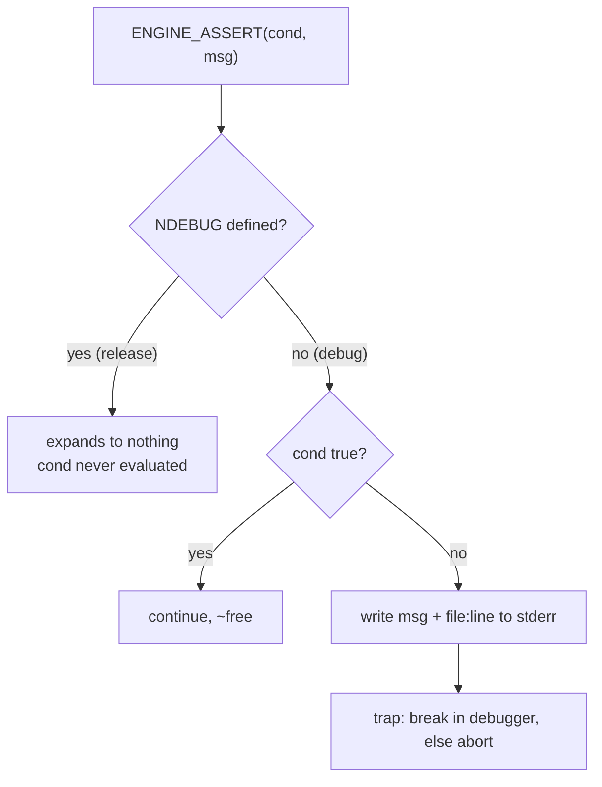

# Assertions

## What it is

An assertion is an executable claim that something is always true at a point in the code. `assert(expr)` is inherited from C; C++ exposes it via `<cassert>`: reach it with `expr` false and the macro prints the expression, file, and line to stderr, then calls `std::abort()`. Define the standard `NDEBUG` macro and `assert` expands to nothing — every check vanishes. So an assert is a check you write for development and delete automatically for release.

The rule of thumb: an assert catches a **programmer bug** — a broken invariant meaning the code, not the input, is wrong. A negative damage value from a caller mistake is an assert. A malformed mod file from a user is not — that is an expected failure, returned as `tl::expected` (ADR-0017).

## Why you care

The engine will run a fixed 60 Hz tick (ADR-0002), and the master plan makes `ENGINE_ASSERT` the standard way to encode invariants — the same one rule that governs errors (ADR-0017). That macro is **planned, not built** — the engine core lands at M2 ([roadmap](../../engine/roadmap.md)). Learn asserts now and you write the invariant the moment you assume it — "this handle is alive" — so it fails loudly the first time reality disagrees, not twenty ticks later as a desync.

!!! tip
    The dividing line: could a correct program ever hit this at runtime? A broken mod, a dropped packet, a missing file — yes, so return `tl::expected` (ADR-0017). A dead entity handle in your own system — no, so `ENGINE_ASSERT` and halt.

## Quick start

Plain `assert` works today with zero setup:

```cpp
#include <cassert>
int clamp_hp(int hp, int max) {
    assert(max > 0);        // programmer bug if false
    if (hp > max) hp = max;
    return hp;
}
int main() { return clamp_hp(150, 100) == 100 ? 0 : 1; }
```

Engines outgrow it fast: `assert` carries no message, cannot break into the debugger, and is all-or-nothing on `NDEBUG`. So they build one macro — a minimal `ENGINE_ASSERT`, the shape the engine's will take:

```cpp
#include <cstdio>
#include <cstdlib>

#if defined(__clang__) || defined(__GNUC__)
    #define ENGINE_TRAP() __builtin_trap()   // breaks into an attached debugger
#else
    #define ENGINE_TRAP() std::abort()
#endif

#ifdef NDEBUG
    #define ENGINE_ASSERT(cond, msg) ((void)0)
#else
    #define ENGINE_ASSERT(cond, msg)                                       \
        do {                                                               \
            if (!(cond)) {                                                 \
                std::fprintf(stderr, "ASSERT failed: %s\n  %s\n  %s:%d\n", \
                             #cond, (msg), __FILE__, __LINE__);            \
                ENGINE_TRAP();                                             \
            }                                                              \
        } while (0)
#endif

int main() {
    ENGINE_ASSERT(2 + 2 == 4, "arithmetic is broken");
    return 0;
}
```

That compiles clean under `clang++ -std=c++20 -Wall -Wextra`, adding a message and a debugger break.

## How it works

An assert is a branch the compiler can erase. In a debug build the condition runs every time; if it holds, the branch predicts and moves on for near-zero cost. If it fails, the macro formats a diagnostic and traps. Define `NDEBUG` — release builds do by default — and the whole thing preprocesses away, so the shipped binary pays nothing and **never runs the condition**. Put no side effects in an assert: a state change that only happens in debug is a bug in release.



Bigger engines add **tiers** so one macro serves every build. SDL3 is the model: `SDL_assert` fires in debug, `SDL_assert_release` stays live in release too, and `SDL_assert_paranoid` runs only at the highest `SDL_ASSERT_LEVEL`. On failure it offers to retry, break into the debugger, or ignore — not just abort. Unreal splits the idea across `check` (halt), `verify` (halt, but still evaluate the expression when checks are off), and `ensure` (log and continue). The engine's `ENGINE_ASSERT` will pick one such tiering.

## Pros / Cons

| Pros | Cons |
|------|------|
| An invariant as executable code, not a comment that rots | Off in release by default, so the guarded bug can still ship |
| Fails at the cause, not later at the symptom | Silently skips side effects placed in the condition |
| Zero cost in release — compiles out under `NDEBUG` | Halts the process — wrong for anything a user can cause |
| Turns "impossible" states into a located crash | A wall of asserts on hot paths slows debug builds |

## What to expect

A failed assert stops the program at one line. Attach a debugger — the trap hands control straight to it — and read the call stack: the assert is where the invariant broke, the frames above are how you got there. Most of the payoff is writing them early: assert every assumption, so the check predates the bug.

Asserts see logic, not memory. A dangling reference or a data race can leave every invariant true while the program is already wrong; those need sanitizers ([debugging with sanitizers](../cpp/debugging-with-sanitizers.md)). And what a failed assert should do in a **shipped** build — write a minidump, phone home, or die quietly — is owned by [crash reporting](crash-reporting.md). Here, an assert means one thing: stop now, a programmer was wrong.

!!! warning
    Never put work inside an assert condition — `ENGINE_ASSERT(spawn_entity(), "...")`. Under `NDEBUG` the expression is deleted, the entity never spawns, and release diverges from debug. Assert on a value computed on its own line first.

## Go deeper

- [Logging strategy](logging-strategy.md) — where a live assert writes (ADR-0021).
- [Crash reporting](crash-reporting.md) — a failed assert in a shipped build.
- [The three testing lanes](the-three-testing-lanes.md) — the invariants tests exercise.
- [Debugging with sanitizers](../cpp/debugging-with-sanitizers.md) — the memory bugs asserts miss.
- [CMake minimum](../cpp/cmake-minimum.md) — where a build sets `NDEBUG`.
- [Compilation model](../cpp/compilation-model.md) — how the preprocessor erases the macro.
- [Command funnel](../architecture/command-funnel.md) — a seam to assert inputs.
- [Fixed timestep](../architecture/fixed-timestep.md) — the 60 Hz tick invariants guard.
- [Determinism limits](../physics/determinism-limits.md) — asserting convergence after misprediction.
- [ADR-0017 errors at boundaries](../../engine/architecture/adr-0017-errors-expected-boundaries.md); [master plan](../../design/master-plan.md); [roadmap M2](../../engine/roadmap.md).

Sources:

- cppreference — assert — https://en.cppreference.com/cpp/error/assert — accessed 2026-07-06
- SDL3 Assertions category (SDL_assert levels) — https://wiki.libsdl.org/SDL3/CategoryAssert — accessed 2026-07-06
- Asserts in Unreal Engine (check / verify / ensure) — https://dev.epicgames.com/documentation/en-us/unreal-engine/asserts-in-unreal-engine — accessed 2026-07-06
