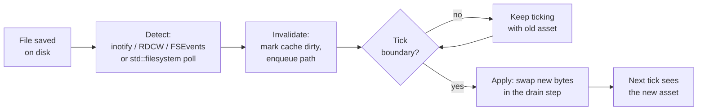

# Asset Hot Reload

## What it is

**Asset hot reload** is a dev-mode loop that collapses "edit, rebuild, relaunch, navigate back to where you were" into "save the file, see the change." The engine watches your asset files while the game runs; when one changes it reloads that asset in place, world still ticking. The engine plans this for textures, meshes, and shaders at **M2**, and Luau script reload at **M6** ([roadmap](../../engine/roadmap.md)) — neither exists yet.

Three moving parts, always in this order: **watch** a set of files, **invalidate** the cached asset when one changes, **apply** the new bytes at a safe moment. This page is about that loop, not the assets it moves.

## Why you care

Iteration speed is the whole point. A colony sim's feel lives in thousands of tiny edits — a texture's tint, a mesh's scale, a shader constant. A rebuild-relaunch cycle costs a minute; a save-and-see costs a second — ten ideas a day instead of two.

A second reason is specific to this engine. It will run a [fixed 60 Hz tick](../architecture/fixed-timestep.md) behind a determinism/replay harness that will re-run recorded inputs and demand identical per-tick state hashes (roadmap M2, [ADR-0018](../../engine/architecture/adr-0018-testing-three-lanes.md)) — neither exists yet. A reload that mutated sim data **mid-tick** would leave one tick half-old, half-new, and the [replay](replay-based-testing.md) of that session would diverge. So reloads must land on a tick boundary, never inside one.

## Quick start

The laziest watcher is a polling loop: remember each file's last-write time, rescan every so often, report the ones that moved. No OS API, no threads, portable everywhere.

```cpp
#include <filesystem>
#include <unordered_map>
#include <vector>
#include <string>
#include <cstdio>

namespace fs = std::filesystem;

// A dumb polling watcher: scan a tree, compare write times, report what moved.
class AssetWatcher {
    fs::path root_;
    std::unordered_map<std::string, fs::file_time_type> stamps_;
public:
    explicit AssetWatcher(fs::path root) : root_(std::move(root)) { poll(); }

    // Files whose last_write_time changed since the previous poll.
    std::vector<std::string> poll() {
        std::vector<std::string> changed;
        std::error_code ec;
        auto it = fs::recursive_directory_iterator(root_, ec);
        const fs::recursive_directory_iterator end;
        for (; !ec && it != end; it.increment(ec)) {
            if (!it->is_regular_file(ec)) continue;
            const auto key = it->path().string();
            const auto mtime = fs::last_write_time(it->path(), ec);
            if (ec) { ec.clear(); continue; }
            auto [slot, inserted] = stamps_.try_emplace(key, mtime);
            if (!inserted && slot->second != mtime) {
                slot->second = mtime;          // remember the new time
                changed.push_back(key);        // and report the file
            }
        }
        return changed;
    }
};

int main() {
    AssetWatcher watcher{fs::temp_directory_path()};
    for (const auto& path : watcher.poll())    // reports real edits
        std::printf("reload: %s\n", path.c_str());
    return 0;
}
```

Call `poll()` a few times a second, not every frame; hand each returned path to whatever owns that asset.

## How it works

The loop splits into **detection** and **application**.

Detection has two options. The lazy one is the poll above: dumb, portable, fine for the few hundred assets a dev build touches. The efficient one is the OS telling you — **inotify** (Linux), **ReadDirectoryChangesW** (Windows), **FSEvents** (macOS) — the kernel pushes an event the instant a file changes, so you scan nothing. The three APIs differ enough that most engines wrap them with **efsw**, which drives all three and falls back to polling if a backend fails.

Application is where the fixed tick matters. The watcher never swaps an asset itself; it marks the cached entry dirty (or enqueues the path). The swap happens **between ticks**, in a drain step at the boundary. No tick sees a half-swapped asset; a render-only asset like a texture swaps between frames without the sim noticing.



One gotcha the diagram hides: editors rarely write a file in one shot — many write a temp file then rename, so a naive watcher can fire on a **half-written** file. inotify separates `IN_MODIFY` (every write) from `IN_CLOSE_WRITE` (writer closed the handle); a polling watcher debounces instead — wait for the mtime to stop moving before reloading.

## Pros / Cons

| | Pros | Cons |
|---|---|---|
| **Polling** | Zero dependencies, portable | Scans the tree; latency is the poll interval |
| **Native events** | Instant, near-zero CPU | Three OS APIs, threading, overflow handling |
| **Hot reload** | Save-to-see; render assets swap between frames | Dev-mode only; sim assets wait for the boundary |

## What to expect

- Asset reload is an **M2** deliverable; Luau script reload is **M6** ([roadmap](../../engine/roadmap.md)). Both are planned, not built.
- Reload is a **dev-mode** tool. Shipping content into a co-op session goes through hash-verified mod packaging ([ADR-0015](../../engine/architecture/adr-0015-luau-modding.md)), never the watcher.
- Both native backends drop events under load — inotify raises `IN_Q_OVERFLOW`, ReadDirectoryChangesW returns an empty buffer — both mean: rescan the tree. Your poll never had that failure mode, half of why it is enough here.

!!! tip
    Start with the polling loop; stay there unless a profile says otherwise. Native file-watch APIs buy latency and CPU you will not miss on a dev build.

!!! info
    What the reloaded assets **are** lives elsewhere: pixels in [textures](../rendering/textures.md), vertices in [meshes on the GPU](../rendering/meshes-on-the-gpu.md). C++ code hot reload is deliberately not built — [the compilation model](../cpp/compilation-model.md) explains why a native rebuild is the honest cost.

## Go deeper

- [Dear ImGui debug UI](dear-imgui-debug-ui.md) — force a reload from the overlay.
- [Replay-based testing](replay-based-testing.md), [the three testing lanes](the-three-testing-lanes.md) — the harness a mid-tick swap breaks.
- [Logging strategy](logging-strategy.md) — where a reload logs its swaps and parse errors.
- [Compilation model](../cpp/compilation-model.md) — why C++, unlike an asset, cannot cheaply hot reload.
- [CMake minimum](../cpp/cmake-minimum.md) — where a file-watcher dependency would be wired.
- [Debugging with sanitizers](../cpp/debugging-with-sanitizers.md) — a swap that frees a live asset is a use-after-free.
- [Fixed timestep](../architecture/fixed-timestep.md), [the game loop](../architecture/game-loop.md) — the tick boundary the apply step waits for.
- [Command funnel](../architecture/command-funnel.md) — the path a dev-command reload routes through.
- [Textures](../rendering/textures.md), [meshes on the GPU](../rendering/meshes-on-the-gpu.md), [render pipeline](../rendering/render-pipeline.md), [HLSL shader basics](../rendering/hlsl-shader-basics.md) — the assets a reload touches.
- [Determinism limits](../physics/determinism-limits.md), [physics on a fixed tick](../physics/physics-on-a-fixed-tick.md) — why a collision-shape swap waits for the boundary.
- [ADR-0018 testing lanes](../../engine/architecture/adr-0018-testing-three-lanes.md), [ADR-0015 Luau modding](../../engine/architecture/adr-0015-luau-modding.md), [roadmap M2/M6](../../engine/roadmap.md) — the canonical plan.

**Sources**

- SpartanJ/efsw — cross-platform file-watcher library — https://github.com/SpartanJ/efsw — accessed 2026-07-06
- inotify(7) — Linux manual page — https://man7.org/linux/man-pages/man7/inotify.7.html — accessed 2026-07-06
- ReadDirectoryChangesW — Microsoft Learn — https://learn.microsoft.com/en-us/windows/win32/api/winbase/nf-winbase-readdirectorychangesw — accessed 2026-07-06
