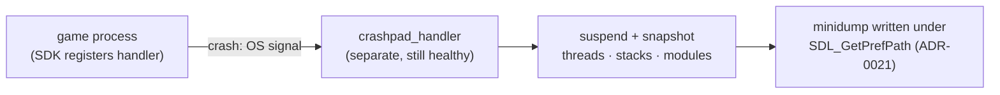
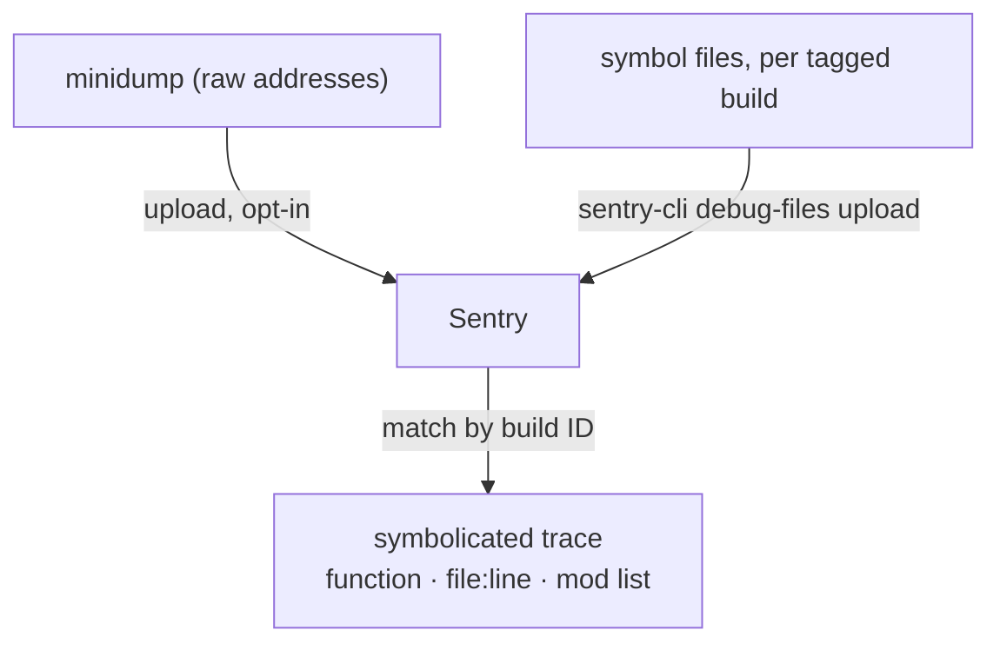

# Crash Reporting

## What it is

A crash report is the forensic snapshot of a program the instant it died — the faulting thread, every thread's call stack, registers, and loaded modules — serialized to a small file called a **minidump**. It is how a segfault on a stranger's PC in another country becomes a stack trace on your screen.

The hard part is that a crashing process is the worst possible narrator: its memory may be corrupt, and its own crash handler may be the next thing to fault. Modern crash reporting solves this by moving the reporter **out of the process entirely**. A separate watchdog process watches yours; when yours dies, the watchdog — still healthy — reaches in and writes the dump.

## Why you care

You ship to players, not to your debugger. Once the engine reaches real users you will get crashes you cannot reproduce: one GPU driver, a rare mod combination, a save from three versions ago. Without a report you have a forum post that says "it crashed"; with one you have the exact faulting line.

Crash reporting is **planned for M8b** — Crashpad plus the Sentry free tier ([master plan M8b](../../design/master-plan.md), [roadmap M8b](../../engine/roadmap.md)). It is not built: `vcpkg.json` today carries SDL3, EnTT, spdlog, and Catch2, no Crashpad. Every dump will carry the loaded **mod list**, so a crash unique to one mod stack is visible at a glance, and the whole path will be **opt-in** behind a consent prompt and a privacy page.

## Quick start

Three parts ship together: the SDK linked into the game, the `crashpad_handler` executable beside it, and — uploaded separately at build time — the **symbol files** for that exact release. The planned initialisation, from the Sentry Native SDK:

```cpp
// fragment — does not compile alone (needs sentry-native + shipped crashpad_handler)
#include <sentry.h>

int main() {
    sentry_options_t* o = sentry_options_new();
    sentry_options_set_dsn(o, "https://<key>@o0.ingest.sentry.io/0");
    sentry_options_set_handler_path(o, "crashpad_handler"); // out-of-process
    sentry_options_set_release(o, "engine@0.8.0+m8b");      // identifies the build (release grouping)
    sentry_init(o);
    // ... run the game; a crash is captured automatically ...
    return sentry_close();
}
```

Miss the symbols and every dump comes back as raw hex addresses — archiving them per tagged build is the discipline it all rests on.

## How it works

Two things happen at two different times.

**At crash time, out of process.** The handler registered at startup is a sibling process, not a signal handler inside yours. When your process faults, the OS notifies the handler, which suspends the dying process, snapshots its threads and memory into its **own** address space, then writes the minidump. Because the reporter never runs inside the corrupted process, it survives the very failure it records — Crashpad's design note puts it as generating the report "with as little execution in the crashed process as possible."



**Later, on upload.** A minidump is tiny and full of raw addresses — meaningless without the symbol files that map address → function → file:line. Those symbols never ship to players (they are large, and hand your source layout away); you archive them to Sentry per tagged build instead. Sentry matches an incoming dump to its symbols by a **build ID** baked into both, then **symbolicates** server-side into a readable stack trace.



## Pros / Cons

| Pros | Cons |
|------|------|
| Turns unreproducible field crashes into stack traces | Only catches crashes — hangs and logic bugs need other tools |
| Out-of-process handler survives memory corruption | Symbol archiving must be disciplined, every build |
| Minidumps are small — cheap to upload and store | Raw addresses are useless without the matching symbols |
| Mod list in each dump isolates mod-specific crashes | Needs consent and privacy plumbing before you may ship it |
| Sentry free tier ingests and symbolicates for you | Another executable to ship and keep beside the binary |

## What to expect

A minidump is a memory snapshot, not a narrative. It tells you **where** the process died, rarely **why** — the state that led there lives in your log files ([logging strategy](logging-strategy.md)), which is why the two are read side by side.

Two boundaries are worth naming. Deciding to abort on purpose — the `ENGINE_ASSERT` calls that **cause** the controlled crashes worth reporting — belongs to [assertions](assertions.md). And the 99%-crash-free-sessions release gate, plus the exact consent **wording**, are owned by [master plan M8b](../../design/master-plan.md) and the future Shipping track, not this page.

!!! warning
    A dump can contain whatever was in RAM at the fault, including player data. That is why M8b makes reporting opt-in behind a privacy page. Treat a minidump as sensitive: it is not just a stack trace.

## Go deeper

- [Assertions](assertions.md) — where the deliberate crashes worth reporting come from.
- [Logging strategy](logging-strategy.md) — the running context you read beside a dump.
- [The three testing lanes](the-three-testing-lanes.md) and [replay-based testing](replay-based-testing.md) — catching bugs **before** they reach a player's machine.
- [Debugging with sanitizers](../cpp/debugging-with-sanitizers.md) — finding the corruption a dump only reports after the fact.
- [CMake minimum](../cpp/cmake-minimum.md) — where the handler and symbol upload get wired into the build.
- [Compilation model](../cpp/compilation-model.md) — what a build ID and a symbol file actually are.
- [ADR-0021](../../engine/architecture/adr-0021-writes-under-prefpath.md) — the `SDL_GetPrefPath` write-root dumps land under.
- [Roadmap M8b](../../engine/roadmap.md), [master plan M8b](../../design/master-plan.md) — where crash reporting enters and its release gate.

Sources:

- Crashpad README — chromium.googlesource.com — https://chromium.googlesource.com/crashpad/crashpad/+/HEAD/README.md — accessed 2026-07-06
- Crashpad Overview Design — https://chromium.googlesource.com/crashpad/crashpad/+/HEAD/doc/overview_design.md — accessed 2026-07-06
- Sentry Native SDK documentation — https://docs.sentry.io/platforms/native/ — accessed 2026-07-06
- Sentry — Google Crashpad integration guide — https://docs.sentry.io/platforms/native/guides/crashpad/ — accessed 2026-07-06
