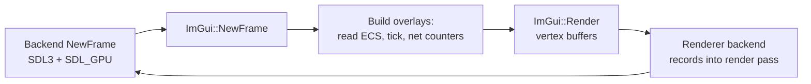

# Dear ImGui for Debug UI

## What it is

**Immediate-mode GUI** flips how you think about interface code. There is no retained widget tree you build once and mutate; instead you **rebuild the whole UI every frame from your live data**. Want a checkbox for `paused`? You call `ImGui::Checkbox("Paused", &paused)` inside the frame, and the widget reads and writes your variable directly. Because the UI holds no state of its own, there is nothing to keep in sync, and the classic bug where the label says one thing while the model holds another simply cannot happen.

**Dear ImGui** is the de-facto implementation: a "bloat-free graphical user interface library for C++ with minimal dependencies" (its own tagline) that emits vertex buffers for your renderer to draw. It is the industry-standard debug-overlay tool. The engine will adopt it as its **M2 debug overlay** and later as the whole slice UI ([ADR-0022](../../engine/architecture/adr-0022-imgui-slice-ui.md), [roadmap M2](../../engine/roadmap.md)) — planned, not built.

## Why you care

A colony sim on a [fixed 60 Hz tick](../architecture/fixed-timestep.md) over an [ECS](../architecture/ecs-pattern.md) world is opaque: thousands of components mutate each tick with nothing on screen to prove it. You need to open the hood while it runs — read a colonist's components, watch tick timing, count network packets — without stopping the sim or writing a UI framework first. That is exactly the job ImGui is built for.

Retained toolkits (Qt, the browser DOM) make you store widget objects and mirror your data into them, then reconcile the two. For a debug tool wired to fast-changing simulation state, that mirror is pure overhead and a bug farm. ImGui reads the source of truth every frame, so an inspector cannot drift from what the sim actually holds.

## Quick start

Two backends bridge ImGui to your stack: a **platform** backend (windows, input) and a **renderer** backend. The engine's targets are `imgui_impl_sdl3` and `imgui_impl_sdlgpu3`, matching [SDL3](../../engine/architecture/adr-0008-sdl3-platform.md) and the [SDL_GPU renderer](../rendering/sdl-gpu-api.md).

```cpp
// fragment — does not compile alone
ImGui::CreateContext();
ImGui_ImplSDL3_InitForSDLGPU(window);
ImGui_ImplSDLGPU3_Init(&init_info);   // device + swapchain format
```

Then, once per rendered frame:

```cpp
// fragment — does not compile alone
ImGui_ImplSDLGPU3_NewFrame();
ImGui_ImplSDL3_NewFrame();
ImGui::NewFrame();

ImGui::Begin("Tick");
ImGui::Text("tick %llu  |  %.2f ms", tick, frameMs);   // reads live values
ImGui::End();

ImGui::Render();   // builds draw data; the render backend submits it
```

## How it works

The whole model is one word: **immediate**. A call like `if (ImGui::Button("Spawn")) spawn();` both draws the button and returns `true` on the frame it is clicked — no callbacks, no signal wiring. The library does keep a little internal state (window positions, what is hovered), but your application data stays the single source of truth.

Each frame runs a fixed order: the two backends and the core each get a `NewFrame`, you build widgets by calling into your data, `ImGui::Render()` turns that into a vertex and index buffer, and the renderer backend records it into the active [render pass](../rendering/render-pipeline.md). How that draw data reaches the GPU is the renderer's job, not this page's.



The overlays worth building first mirror the engine's risk areas: a **tick/frame panel** (tick number, ms per tick, catch-up steps), an **entity inspector** that walks the EnTT registry and prints a selected entity's components, and **netcode counters** (snapshot size, RTT, reconciliation corrections). Each is just `Text`/`Checkbox`/`SliderFloat` calls reading live data.

```cpp
// fragment — does not compile alone
for (auto [e, pos] : registry.view<Position>().each()) {
    if (ImGui::TreeNode((void*)(intptr_t)e, "entity %u", entt::to_integral(e))) {
        ImGui::Text("pos  %.1f, %.1f, %.1f", pos.x, pos.y, pos.z);
        ImGui::TreePop();
    }
}
```

!!! warning
    ImGui draws on the **render frame**, which runs at display rate, not the fixed 60 Hz tick. An inspector reading mid-tick data is fine for eyeballing, but never let a debug widget **write** simulation state outside the [command funnel](../architecture/command-funnel.md) — that single path is what keeps the sim deterministic and replayable.

## Pros / Cons

| Pros | Cons |
|---|---|
| No retained tree — UI cannot desync from your data | Restyling for production UI is real work (M8 pass) |
| A useful panel is minutes of code | Immediate model is unfamiliar coming from Qt/DOM |
| Renderer- and platform-agnostic via backends | You own the backend wiring and its upgrades |
| Industry standard for engine debug tools | Not an accessibility or gamepad framework by default |

## What to expect

- The debug overlay lands at **M2**; theming, gamepad operability, and the colony-management UI are a later production pass (M8, [ADR-0022](../../engine/architecture/adr-0022-imgui-slice-ui.md)) — out of scope here.
- Mods never touch raw ImGui; they get a constrained Luau HUD API, owned by the future Scripting track.
- Pair the overlay with [Tracy](profiling-with-tracy.md) for timing and [structured logging](logging-strategy.md) for history — ImGui shows the current frame, those two show change over time.

## Go deeper

- [Profiling with Tracy](profiling-with-tracy.md) — frame timing the overlay cannot graph well.
- [Logging strategy](logging-strategy.md) — the sibling for state that outlives one frame.
- [Fixed timestep](../architecture/fixed-timestep.md) and [command funnel](../architecture/command-funnel.md) — why debug writes route through one path.
- [The SDL3 GPU API](../rendering/sdl-gpu-api.md), [render pipeline](../rendering/render-pipeline.md) — how draw data actually reaches the GPU.
- [ADR-0022](../../engine/architecture/adr-0022-imgui-slice-ui.md) — the decision to make ImGui the slice UI.

**Sources**

- Dear ImGui — About the IMGUI paradigm (wiki) — https://github.com/ocornut/imgui/wiki/About-the-IMGUI-paradigm — accessed 2026-07-06
- Dear ImGui — Getting Started (wiki) — https://github.com/ocornut/imgui/wiki/Getting-Started — accessed 2026-07-06
- ocornut/imgui repository README — https://github.com/ocornut/imgui — accessed 2026-07-06

**Video**

- Immediate-Mode Graphical User Interfaces — Casey Muratori (2005) — https://www.youtube.com/watch?v=Z1qyvQsjK5Y — ~40 min. Watch after you have written one overlay, to see why immediate mode holds no state.
