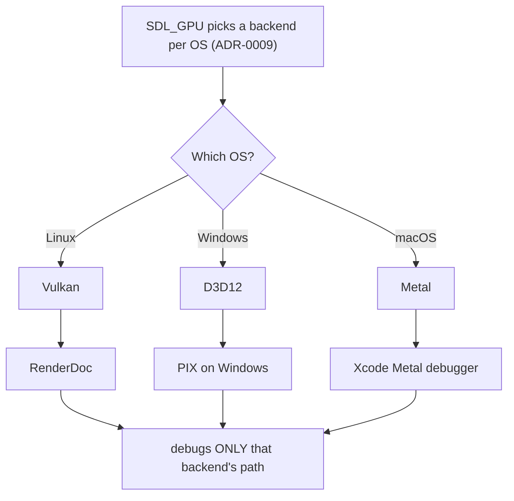
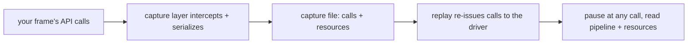

# GPU Frame Capture

## What it is

A GPU frame capture records **every graphics API call your program makes during one frame** — each draw, state change, resource bind, and shader dispatch — into a file you reopen offline. You then step through that frame call by call and inspect the exact draws, pipeline state, bound textures and buffers, and shader inputs and outputs that produced each pixel.

It is the GPU's equivalent of single-stepping in a debugger. No amount of CPU-side `printf` reaches a wrong pixel, because the bug lives in data the GPU consumed and threw away. A capture is where that data still exists.

## Why you care

A wrong pixel — black where it should be lit, geometry missing, a texture sampled from the wrong mip — has too many suspect stages to reason about from source alone: the vertex transform, rasterizer state, the bound texture, the sampler, the blend mode, the shader math. A capture lets you check each stage against ground truth, so you **bisect the pipeline instead of guessing**.

The catch is portability. The engine will render through SDL_GPU, which selects a different native backend per OS ([ADR-0009](../../engine/architecture/adr-0009-sdl-gpu-renderer.md)): Vulkan on Linux, D3D12 on Windows, Metal on macOS. There is no single cross-platform capture tool — each backend has its own, and a capture never debugs another backend's path.

## Quick start

Pick the tool for the backend you are on. All three are external GUI applications, not code you link:

- **Linux / Vulkan → RenderDoc.** File → Launch Application, press **F12** mid-run to grab the next frame; the app exits into the UI. The **Event Browser** lists every action, the **Texture Viewer** shows render targets, and right-clicking a bad pixel opens pixel history and the shader debugger.
- **Windows / D3D12 → PIX on Windows.** Take a **GPU capture**, open it, and inspect draws, pipeline state, resources, and shader code frame by frame.
- **macOS / Metal → Xcode's Metal debugger.** Trigger a **GPU frame capture**; the dependency viewer shows draw order and data flow, and you can step through shader code at the pixel level.

The workflow is identical everywhere: capture one frame, find the draw that touches your pixel, inspect its inputs, compare against what you expected.

!!! warning
    A capture is backend-scoped. The Metal capture on your Mac only ever exercises the Metal path — the D3D12 path can be broken in ways it will never show. That blind spot is why the roadmap has you buy a Windows test box and learn PIX at M1 ([hardening blind spots](../../design/hardening-blindspots.md)).

## How it works

The capture layer inserts itself **between your program and the graphics driver**. During the captured frame it serializes every API call plus the resource contents — buffers, textures, compiled shaders — into the file. Replay re-issues those calls against the real driver, pausing after any one you pick so you can read back the full pipeline state and every resource as it stood at that call.

Because replay runs the driver's real calls rather than a model of them, what you inspect is what the hardware actually did.

## Pros / Cons

| Pros | Cons |
|------|------|
| The only way to answer "why is this pixel wrong?" | One tool per backend — three tools to learn |
| Shows real driver state, not a guess | A capture debugs one backend only, never the others |
| Inspect any draw, resource, and shader offline | Needs the target OS and hardware to capture on |
| Free — first-party on Windows/macOS, RenderDoc on Linux | Debugs the compiled shader (DXIL/SPIR-V/MSL), not your HLSL |

## What to expect

Your first captures land at M1, when the renderer is just triangle → textured cube → camera → mesh ([master plan](../../design/master-plan.md)). Early on you will mostly confirm boring things: the texture is bound, the vertex reached clip space, depth-test is set the way you meant. That confirmation is the point — it turns a vague "it's dark" into a specific broken stage.

Two surprises are worth bracing for. Shaders will be offline-compiled from one HLSL source to three backend forms ([ADR-0009](../../engine/architecture/adr-0009-sdl-gpu-renderer.md)), so the shader you debug is the compiled DXIL, SPIR-V, or MSL — not the HLSL you wrote. And a frame that looks right on macOS can still be wrong on Windows: a capture proves correctness for **one** path, so "renders correctly on the Windows box" stays a separate exit gate.

!!! info
    Frame capture answers "why is this pixel wrong?", not "why is this frame slow?" — CPU-side and per-pass timing belong to Tracy ([profiling with Tracy](profiling-with-tracy.md)).

## Go deeper

- [Profiling with Tracy](profiling-with-tracy.md) — the other half: CPU and frame **timing**, not correctness.
- [Dear ImGui debug UI](dear-imgui-debug-ui.md) — the in-engine overlay for live state.
- [Debugging with sanitizers](../cpp/debugging-with-sanitizers.md) — the CPU-side fail-fast tool this complements.
- [Render pipeline](../rendering/render-pipeline.md) and [GPU mental model](../rendering/gpu-mental-model.md) — the stages a capture inspects.
- [SDL GPU API](../rendering/sdl-gpu-api.md) — the object model whose calls get recorded.
- [HLSL shader basics](../rendering/hlsl-shader-basics.md) — fixing the shaders a capture points at.
- [ADR-0009](../../engine/architecture/adr-0009-sdl-gpu-renderer.md) — why SDL_GPU, and the per-OS backends.
- [Roadmap](../../engine/roadmap.md) — M1 first pixels, where capture tooling enters.

Sources:

- RenderDoc documentation — Quick Start — https://renderdoc.org/docs/getting_started/quick_start.html — accessed 2026-07-06
- PIX on Windows documentation — https://devblogs.microsoft.com/pix/documentation/ — accessed 2026-07-06
- Metal debugger — Apple Developer Documentation — https://developer.apple.com/documentation/xcode/metal-debugger — accessed 2026-07-06
