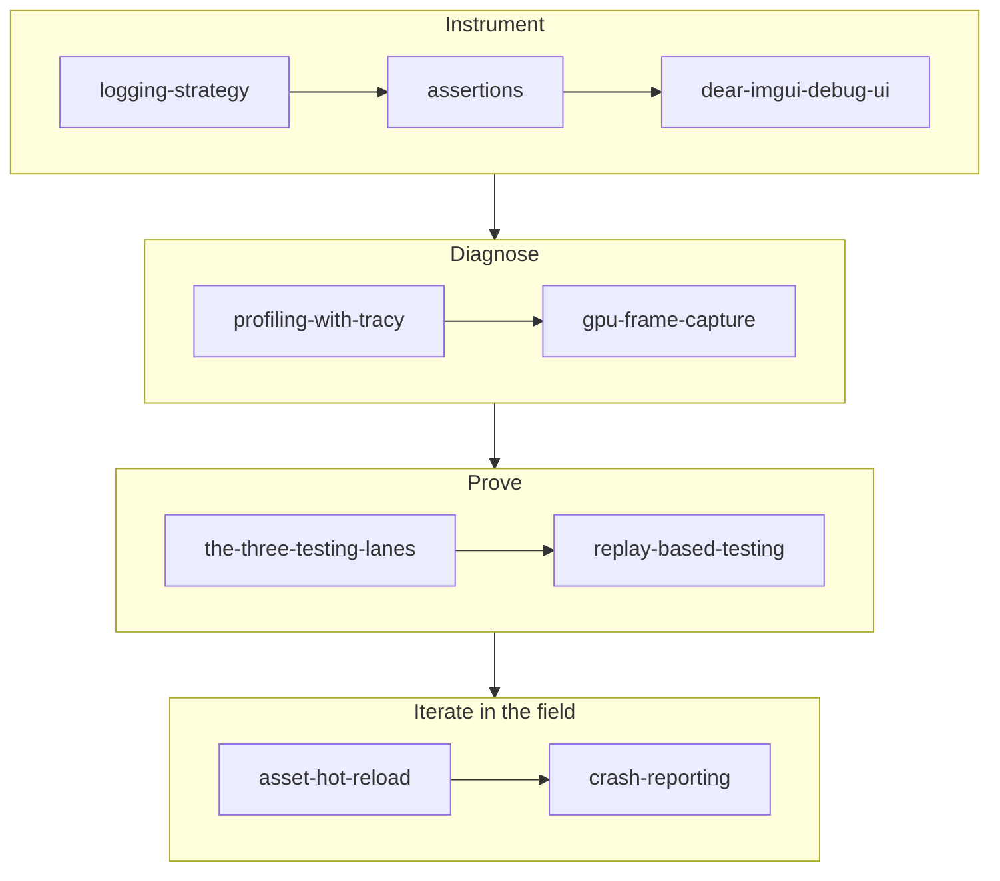

# Tooling

## What it is

This track is the instrument panel for the engine — the debug overlay, profiler, frame captures, logs, asserts, tests, hot-reload, and crash reports you build **alongside** a fixed 60 Hz colony-sim so you can see what a simulation running sixty times a second is actually doing. These are not engine features; they are the tools that make the features debuggable.

## Why you care

A tight edit → run → understand loop is the difference between a weekend of progress and a weekend lost to guessing. On a deterministic, server-authoritative sim the stakes sharpen: a bug can hide for a thousand ticks before a state hash diverges, and it may live only on a player's machine you will never touch. These pages are how you catch it anyway.

!!! info
    The engine is pre-M1 — none of this is wired in yet. Every engine-specific claim is planned tense with a link to the [master plan](../../design/master-plan.md), the [roadmap](../../engine/roadmap.md), or an [ADR](../../engine/architecture/index.md). Treat the pages as the plan of record, not a description of shipped code.

## How it works

Read in order. The first three pages give you eyes on a running frame, the next two diagnose why it is slow or wrong, then two prove it stays correct, and the last two shorten the loop and reach machines you will never see.

| Page | Takeaway |
|---|---|
| [Logging Strategy](logging-strategy.md) | Levels as policy, sinks, and structured context (tick, entity id) for a loop that logs 60 times a second — spdlog bare, writes under SDL's pref path (ADR-0021). |
| [Assertions](assertions.md) | Executable invariants that halt on programmer bugs; build a minimal `ENGINE_ASSERT`, and the assert-vs-`tl::expected` boundary (ADR-0017). |
| [Dear ImGui for Debug UI](dear-imgui-debug-ui.md) | Immediate-mode GUI — rebuild the overlay from your data every frame, no retained tree, no sync bugs; tick stats, entity inspector, netcode counters (ADR-0022). |
| [Profiling with Tracy](profiling-with-tracy.md) | Instrumented zones and frame marks read against a 16.6 ms budget, versus a sampling profiler; one macro per system. |
| [GPU Frame Capture](gpu-frame-capture.md) | Record and replay one frame's API calls to answer "why is this pixel wrong" — RenderDoc, PIX, or Xcode, one tool per backend (ADR-0009). |
| [The Three Testing Lanes](the-three-testing-lanes.md) | Test-first for the deterministic core, test-after for glue, zero for look and feel; Catch2 + CTest, no coverage gates (ADR-0018). |
| [Replay-Based Testing](replay-based-testing.md) | Hash sim state every tick, record the command funnel, replay headlessly — identical hash sequences, or a determinism regression (ADR-0002, ADR-0004). |
| [Asset Hot Reload](asset-hot-reload.md) | Watch → invalidate → reload applied at a tick boundary, so "save file, see change" keeps the determinism harness honest. |
| [Crash Reporting](crash-reporting.md) | Minidumps, an out-of-process handler, and server-side symbolication turn crashes on machines you will never see into fixable bugs (Crashpad + Sentry). |

## What to expect

About an evening per page if you wire the examples into a real frame loop. By the end you can see a running tick, prove it deterministic, and get a stack trace back from a stranger's crash.

## Go deeper

Start with [Logging Strategy](logging-strategy.md). This track leans on the others: [C++ for Game Devs](../cpp/index.md) for the build and sanitizers, [Rendering](../rendering/index.md) for what a frame capture inspects, [Physics](../physics/index.md) and [Netcode](../netcode/index.md) for the determinism the replay harness guards, and the [Architecture](../architecture/index.md) track for the fixed-tick model underneath all of it.

Sources:

- Dear ImGui — https://github.com/ocornut/imgui — accessed 2026-07-06
- Tracy Profiler — https://github.com/wolfpld/tracy — accessed 2026-07-06
- Catch2 — https://github.com/catchorg/Catch2 — accessed 2026-07-06
