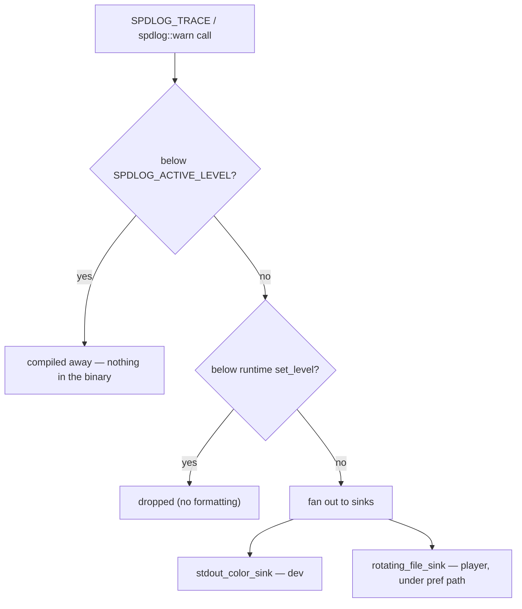

# Logging strategy

## What it is

Logging is the timestamped, leveled record your program writes as it runs, so you can reconstruct what happened without a debugger attached. In a sim that ticks 60 times a second the discipline is unlike a request/response server: log one line per entity per tick and you bury the single line that matters under a million. A logging strategy is deciding up front what earns a line and what stays silent. The engine will use [spdlog](https://github.com/gabime/spdlog) bare as a vocabulary library ([master plan](../../design/master-plan.md)), with the player's logs written under SDL's pref path ([ADR-0021](../../engine/architecture/adr-0021-writes-under-prefpath.md)). Three ideas carry the page: levels as policy, one sink per audience, structured context over prose.

## Why you care

Coming from Python you `print()` and `logging.info()` freely; the interpreter's tracebacks and REPL cover the rest. A compiled 60 Hz loop has no REPL, and by the time a co-op desync surfaces on tick 1403 the cause on tick 1400 is long gone. The log is your flight recorder. Two failure modes bracket it: log everything and the signal drowns (at 60 Hz that is gigabytes an hour); log nothing and a player's bug report is unactionable. The strategy — trace compiled out, `warn` meaning a human should look, tick and entity id on every line — is what makes the record readable after the fact.

## Quick start

Levels are a policy, not a volume knob. spdlog gives six, plus `off`. Assign each a meaning and hold the line:

- **trace / debug** — developer detail; compiled out of release
- **info** — milestones: world loaded, player joined
- **warn** — a human should look, but the sim keeps running
- **error** — something failed; a subsystem degraded
- **critical** — the process is coming down

The key move is compile-time stripping. Define `SPDLOG_ACTIVE_LEVEL` before the include; every `SPDLOG_TRACE` / `SPDLOG_DEBUG` macro below that level expands to nothing — no branch, no cost in the shipped tick.

```cpp
// fragment — does not compile alone (needs spdlog from vcpkg)
#define SPDLOG_ACTIVE_LEVEL SPDLOG_LEVEL_INFO   // strip trace + debug in release
#include <spdlog/spdlog.h>

SPDLOG_TRACE("pathfind step entity={} node={}", id, node); // gone in release
spdlog::warn("nav mesh missing entity={} tick={}", id, tick); // always compiled in
```

Use the macro form (`SPDLOG_TRACE`) for anything strippable — the free-function `spdlog::trace(...)` cannot be compiled out. Then wire audiences to sinks: a color console while you develop, a rotating file on the player's machine so a bug report ships the last few megabytes rather than an unbounded log.

```cpp
// fragment — does not compile alone
auto console = std::make_shared<spdlog::sinks::stdout_color_sink_mt>();
auto file = std::make_shared<spdlog::sinks::rotating_file_sink_mt>(
    path, 5 * 1024 * 1024, /*max files*/ 3);  // path under SDL_GetPrefPath (ADR-0021)
spdlog::logger engine("engine", {console, file});
engine.set_level(spdlog::level::info);        // runtime floor
```

## How it works

Two floors gate every message. The compile-time floor (`SPDLOG_ACTIVE_LEVEL`) decides which macros even exist in the binary. The runtime floor (`set_level`) filters what survives and can be moved at startup — raised to `warn` for players, dropped to `trace` to chase a repro. A message clearing both fans out to every attached sink; `_mt` sinks are mutex-guarded, so one call lands in both the console and the file.



Structured context is the other half. Prefer fields — `tick=`, `entity=` — over sentences, because you grep and correlate on them later. `set_pattern` fixes the frame (time, level, thread); the message carries the variables.

```cpp
// fragment — does not compile alone
engine.set_pattern("[%H:%M:%S.%e] [%^%l%$] %v"); // time, colored level, message
engine.error("solver diverged entity={} tick={} penetration={}", id, tick, depth);
```

## Pros / Cons

| Pros | Cons |
|------|------|
| Compiled-out trace costs nothing in release | Discipline, not tooling — nothing stops a per-tick flood |
| One record survives a crash the debugger never saw | Text cannot answer "what did tick 1400 look like" — that is replay |
| spdlog is fast (millions of lines/sec) and already in `vcpkg.json` | A runtime-filtered call still evaluates its arguments |
| Structured fields grep and correlate across machines | A rotating file caps size, not the noise inside it |

!!! warning
    A runtime `set_level` filter skips formatting the dropped line, but C++ still evaluates the call's arguments first — a costly computed field runs even when the line is discarded. For anything in a hot per-entity loop, use the strippable `SPDLOG_TRACE` macro so the whole statement vanishes in release, never the runtime filter alone.

## What to expect

None of this is built yet: spdlog sits in `vcpkg.json`, but the engine has no logging layer until the engine core comes online ([roadmap](../../engine/roadmap.md)). Your first debugging sessions will go into tuning levels — what read as `info` at write time is noise by the tenth playthrough. Two neighbours own the edges. Fatal invariant violations are not logged-and-continued; they stop the process, which is [assertions](assertions.md). Getting a player's log off their machine is [crash reporting](crash-reporting.md), planned for M8b. This page only covers writing useful records; where the file lives, and why never beside the executable, is [ADR-0021](../../engine/architecture/adr-0021-writes-under-prefpath.md).

## Go deeper

- [Assertions](assertions.md) — the other half of the split: logs record, assertions stop.
- [Crash reporting](crash-reporting.md) — shipping these logs off the player's machine (M8b).
- [Replay-based testing](replay-based-testing.md) — the real answer to "what did tick 1400 look like".
- [Profiling with Tracy](profiling-with-tracy.md) — when the question is speed, not correctness.
- [Debugging with sanitizers](../cpp/debugging-with-sanitizers.md) — the other fail-fast tool for C++ newcomers.
- [Fixed timestep at 60 Hz](../architecture/fixed-timestep.md) — why the tick number is the coordinate every log line hangs off.
- [The command funnel](../architecture/command-funnel.md) — the funnel is the natural place to log every accepted mutation.
- [ADR-0021: writes under pref path](../../engine/architecture/adr-0021-writes-under-prefpath.md); [ADR-0017: errors at boundaries](../../engine/architecture/adr-0017-errors-expected-boundaries.md); [roadmap](../../engine/roadmap.md) M2/M8b rows.

Sources:

- gabime/spdlog repository README — https://github.com/gabime/spdlog — accessed 2026-07-06
- spdlog wiki (QuickStart, sinks, custom formatting) — https://github.com/gabime/spdlog/wiki — accessed 2026-07-06
