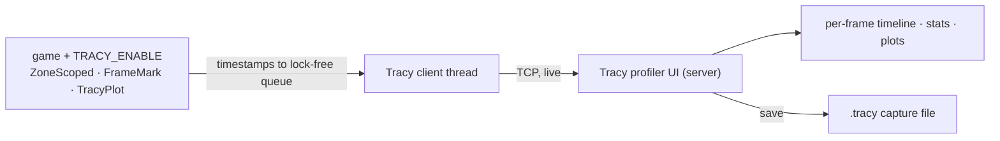

# Profiling with Tracy

## What it is

Two profiler families answer different questions. A **sampling profiler** (perf, Instruments, VTune) interrupts the program hundreds of times a second, records where the call stack was, and reports which functions burned the most CPU. A **frame profiler** instead times named spans you place by hand and lines them up against each frame, so you can ask "what happened during **this** 16.6 ms tick?" and read it as a timeline.

Tracy is a frame profiler (with a sampling mode bolted on). Add a macro or two to the systems you care about and it draws every span, nested, on a per-frame track:

- **Zones** — `ZoneScoped` times the enclosing scope, entry to exit.
- **Frame marks** — `FrameMark` tells Tracy where one frame ends and the next begins.
- **Plots** — `TracyPlot("entities", n)` graphs a number over time beside the zones.
- **A separate profiler app** — the instrumented game is the **client**; the Tracy UI is the **server**, connecting over the network to stream data live while the game runs.

## Why you care

A fixed 60 Hz tick (ADR-0002) will give every frame a 16.6 ms budget; miss it and the sim would stutter. A sampling profiler might call the pathfinder 8% of a ten-minute run — true, but useless when the real problem is one frame in three spiking to 40 ms, which a frame profiler shows as a fat zone you can click.

Per the master plan, the engine will archive a Tracy capture at every milestone exit and write a **frame ledger** at M4 that splits the budget across sim, physics, and render ([roadmap M4](../../engine/roadmap.md)). That tooling is **planned, not built** — `vcpkg.json` pulls spdlog and Catch2 today, not Tracy, so nothing below is wired in yet.

## Quick start

Tracy ships as one `.cpp` plus a header you compile into the game, gated by a single define: the macros expand to nothing unless `TRACY_ENABLE` is set, so they cost zero in a shipping build.

```cpp
// fragment — needs the Tracy client source + -DTRACY_ENABLE
#include <tracy/Tracy.hpp>

void update_ai(World& w)    { ZoneScoped; /* ... */ }
void step_physics(World& w) { ZoneScoped; /* ... */ }
void render(World& w)       { ZoneScoped; /* ... */ }

void tick(World& w) {
    ZoneScopedN("tick");              // names the whole slice
    update_ai(w);
    step_physics(w);
    render(w);
    TracyPlot("entities", w.count()); // a value track
    FrameMark;                        // one frame boundary
}
```

`ZoneScoped` is RAII (see [RAII](../cpp/raii.md)): the timer stops when the scope exits, even on an early return. Build the profiler UI once from the same repo, run the game, and zones stream in live. Save the session to a `.tracy` file to diff later.

## How it works

The client half is nearly free: each zone writes a couple of timestamps into a lock-free queue that a background thread ships over a TCP socket. Almost no data sits in the game process, so a long capture will not bloat it. The server — the UI — does the heavy lifting: aggregating, sorting, drawing.



Because capture is live and networked, you profile the real game on the real target — a Steam Deck over the LAN — not a synthetic bench.

## Pros / Cons

| Pros | Cons |
|------|------|
| Per-frame timeline: you see **which** frame blew the budget, not just averages | Zones are manual — an unmarked system is invisible |
| Nanosecond zones, negligible client cost when instrumented | Adds a build dependency and a define to CMake |
| Live capture over the network, Deck-class hardware included | CPU-side only here; GPU timing is a separate capture |
| Free, one header + one .cpp, works with EnTT/SDL3/Jolt as-is | Instrumented build differs slightly from a clean release |

!!! tip
    Mark whole systems first — one `ZoneScoped` per tick stage — before drilling into hot functions. Four fat zones that sum to 16.6 ms tell you where to look; fifty tiny ones just clutter the timeline.

## What to expect

Reading a capture is pattern-matching against the 16.6 ms line the frame marks draw. A healthy frame is a few wide zones with gaps; a bad one has a single zone eating the budget, or a sawtooth where a stage spikes every Nth frame (usually an allocation or cache-miss cascade). Click a zone for its min, median, and max.

Tracy tells you **slow**, never **wrong** — a use-after-free that corrupts a counter still profiles fine. Correctness lives with [sanitizers](../cpp/debugging-with-sanitizers.md); GPU draw-call timing with [GPU frame capture](gpu-frame-capture.md). The budget split — the numbers each zone must fit under — is owned by the M4 frame ledger, not this page.

!!! warning
    Profile a **release-optimised** build (`-O2`), never a sanitizer or debug build. Debug timings are dominated by unoptimised code and bounds checks; tuning against them chases costs that vanish under `-O2`.

## Go deeper

- [Dear ImGui debug UI](dear-imgui-debug-ui.md) — the overlay Tracy complements.
- [GPU frame capture](gpu-frame-capture.md) — the GPU timing this page defers.
- [Logging strategy](logging-strategy.md) — spdlog, Tracy's toolchain neighbour.
- [Debugging with sanitizers](../cpp/debugging-with-sanitizers.md) — for **wrong**, not **slow**.
- [CMake minimum](../cpp/cmake-minimum.md) — where `TRACY_ENABLE` gets threaded.
- [Fixed timestep](../architecture/fixed-timestep.md) — the 16.6 ms budget Tracy measures against.
- [Render pipeline](../rendering/render-pipeline.md) — what the render zone contains.
- [Determinism limits](../physics/determinism-limits.md) — why the physics zone is fixed-step.
- [ADR-0002 fixed 60 Hz tick](../../engine/architecture/adr-0002-fixed-60hz-tick.md); [roadmap M4](../../engine/roadmap.md) — the frame-ledger plan.

Sources:

- wolfpld/tracy repository — https://github.com/wolfpld/tracy — accessed 2026-07-06
- Tracy Profiler user manual (PDF, v0.13.1) — https://github.com/wolfpld/tracy/releases/latest/download/tracy.pdf — accessed 2026-07-06

Video: An Introduction to Tracy Profiler in C++ — Marcos Slomp, CppCon 2023 — https://www.youtube.com/watch?v=ghXk3Bk5F2U — 62 min — watch after this page for a live tour of zones, plots, and reading a capture.
