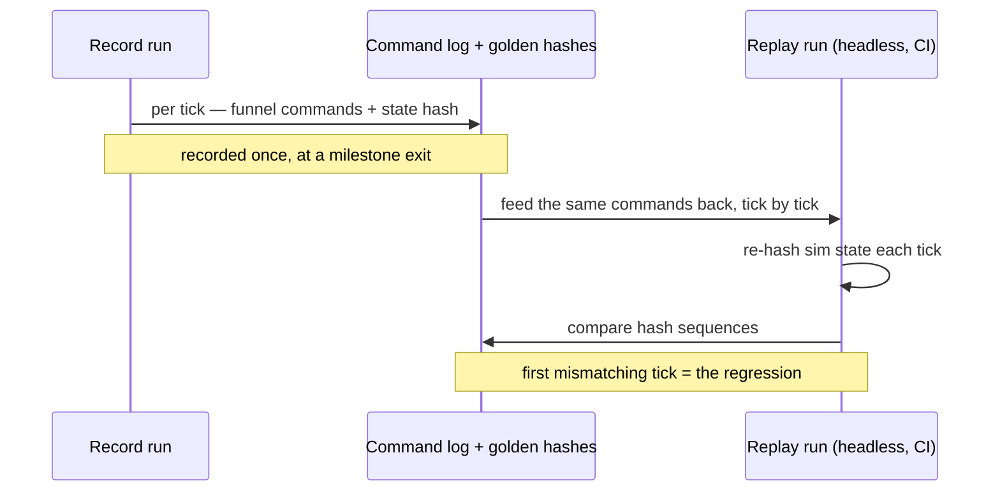

# Replay-Based Testing

## What it is

A replay here is not a video. It is two streams recorded while the simulation runs: the **command log** — every input the [command funnel](../architecture/command-funnel.md) accepted, tick by tick — and a **state hash** taken at the end of each tick. Play the command log back into a fresh, headless simulation and, if the sim is deterministic, you get the identical hash sequence, tick for tick. A mismatch means the two runs diverged, and the first differing tick names exactly when.

This is Factorio's model. It runs **deterministic lockstep** — every machine must "simulate every single tick of the game identically," networking "only the inputs that control that game, rather than networking the state of the objects" (FFF-188). Same trick, turned inward: instead of two players staying in sync, one machine replays yesterday's inputs and checks it still agrees with itself.

## Why you care

A moddable co-op colony sim on a [fixed 60 Hz tick](../architecture/fixed-timestep.md) is a determinism machine or it is nothing. Client prediction, save/load, and server-authoritative multiplayer all assume that the same inputs from the same state produce the same next state. Replay testing is the cheapest way to find out whether that holds — before a player finds out for you, mid-session, as a desync.

The payoff is a regression net that costs almost nothing to grow. The engine will record a **golden replay** at each milestone exit and rerun it on every push ([ADR-0018](../../engine/architecture/adr-0018-testing-three-lanes.md), `TESTING.md`, [roadmap M2](../../engine/roadmap.md)) — planned, not built; `vcpkg.json` pulls Catch2 today, not a harness. When a golden hash sequence breaks, you have a **determinism regression before you have anything else** — a far sharper signal than "a test failed."

## Quick start

Two decisions the engine has already committed to make the harness nearly free. The [fixed tick](../../engine/architecture/adr-0002-fixed-60hz-tick.md) will give the timeline integer-addressable slots to hash. The [one command funnel](../../engine/architecture/adr-0004-one-command-funnel.md) will mean every mutation is a validated, tagged command — so recording will be just teeing the funnel to disk, and hashing will reuse the one bitstream serializer that also writes saves and the wire.

```cpp
// fragment — does not compile alone
for (Tick t = 0; t < ticks; ++t) {
    auto cmds = funnel.drain();     // the funnel's output for this tick
    log.append(t, cmds);            // record the inputs, not the state
    sim.step(cmds);
    BitWriter w;
    sim.serialize(w);               // the same serializer as save + wire
    hashes.push_back(fnv1a(w.bytes()));
}
```

Replay drops the input devices and the renderer, reads `cmds` from `log` instead of the funnel, and compares its `hashes` against the recording.

## How it works

Recording and replay run the exact same `sim.step`; only the source of commands and the presence of I/O differ. That symmetry is the whole point — if step is a pure function of `(state, commands)`, the two hash sequences are identical, and any divergence is a bug in that purity: an unordered container walked in address order, a read of uninitialized memory, a float rounding mode a library flipped.



Because replay needs no window, no GPU, and no wall clock, it runs anywhere CI runs and finishes in seconds. The comparison will gate **per-platform**: same binary, same inputs, twice.

## Pros / Cons

| Pros | Cons |
|---|---|
| A whole play session becomes one cheap, exact regression test | Only as deterministic as the sim — a flaky hash is a real bug, not noise |
| The first divergent tick localizes the failure precisely | Goldens must be re-recorded when sim behaviour changes on purpose |
| Reuses the tick, the funnel, and the one serializer — little new code | Tells you *what* tick diverged, not *why*; you still debug from there |
| Headless: runs in CI, on every platform, with no display | Only covers what the recorded inputs happened to exercise |

!!! warning
    A golden replay is dead weight if it is not re-recorded when the sim changes intentionally. Treat a divergence as a determinism bug **first**; only after ruling that out do you re-bless the golden. Reversing that order trains you to ignore the net.

## What to expect

The harness lands at **M2** with the command funnel; the first golden replay follows at **M4** with the character controller (`TESTING.md`). From then it reruns on every push. It gates **per-platform** — one machine agreeing with itself. Whether cross-platform hashes must *also* match is a separate, non-gating nightly, owned by [determinism limits](../physics/determinism-limits.md), because cross-OS float behaviour is deliberately not a launch gate.

Replay testing tells you the sim diverged; it does not tell you which modules deserve which kind of test — that is [the three testing lanes](the-three-testing-lanes.md) — nor how to chase a live multiplayer desync, which the future Netcode track will own.

## Go deeper

- [The three testing lanes](the-three-testing-lanes.md) — the policy this net sits under; which code gets which test.
- [Assertions](assertions.md) — a hash mismatch is the assertion this harness cannot inline.
- [Logging strategy](logging-strategy.md) — the tick-stamped history you read once a divergence is found.
- [Debugging with sanitizers](../cpp/debugging-with-sanitizers.md) — finds the *why*: the uninitialized read behind a divergence.
- [Command funnel](../architecture/command-funnel.md) and [serialization basics](../architecture/serialization-basics.md) — the recorded stream and the one hash source.
- [Fixed timestep](../architecture/fixed-timestep.md) — the integer timeline replay addresses.
- [Determinism limits](../physics/determinism-limits.md) — why cross-platform hashes are a nightly, not this gate.
- [ADR-0002 fixed tick](../../engine/architecture/adr-0002-fixed-60hz-tick.md), [ADR-0004 command funnel](../../engine/architecture/adr-0004-one-command-funnel.md), [ADR-0018 testing lanes](../../engine/architecture/adr-0018-testing-three-lanes.md), [roadmap M2](../../engine/roadmap.md), [hardening-testing](../../design/hardening-testing.md).

**Sources**

- Factorio Friday Facts #62 — The automation of Factorio — https://www.factorio.com/blog/post/fff-62 — accessed 2026-07-06
- Factorio Friday Facts #188 — Bug, Bug, Desync — https://www.factorio.com/blog/post/fff-188 — accessed 2026-07-06
