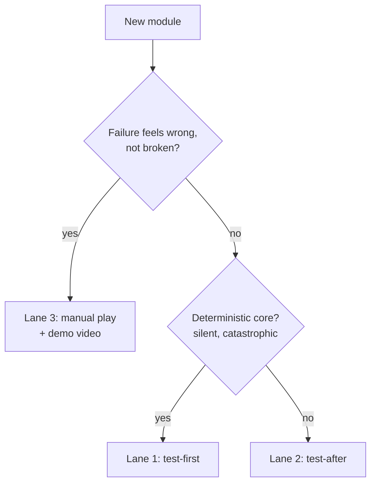

# The Three Testing Lanes

## What it is

Not every line of an engine earns the same testing. This one sorts code into three lanes by what a failure costs (ADR-0018):

- **Lane 1 — test-first.** The deterministic core: bitstream serializer, command funnel, protocol state machines, save migrations, the behavior-tree interpreter — ~25% of the code carrying 80% of the risk. Failing test first, then code (red-green).
- **Lane 2 — test-after.** Glue: ECS systems, asset loading, JSON checks, the Luau binding surface. Tests land in the feature's commit, but the code comes first.
- **Lane 3 — no automated tests.** Look and feel: renderer, animation, audio, tuning. The QA artifact is you playing the build plus a demo video per milestone. You cannot red-green "feels good."

Rule of thumb: a silent, catastrophic failure (a corrupted save, a desync) is Lane 1; a loud, obvious one (a wall clips) is Lane 3.

## Why you care

Two failure modes bracket a solo project. Blanket TDD drowns you in mock objects and taxes the iteration speed gameplay lives on — a TDD study reported 15-35% more initial development time, fine for a serializer and awful for tuning a jump arc. Zero testing feels faster until M5, where un-reproducible desync bugs (the milestone solo multiplayer projects die at, per master-plan.md) cost weeks each. The lanes aim the expensive discipline where it repays.

This is evidence, not taste. Rare built Sea of Thieves's automation as a core discipline, tiered as a pyramid — unit tests under integration tests under headless gameplay bots — reaching 100+ internal deployments before launch with a small test team. Riot's Build Verification System runs ~5,500 scripted in-game cases per League build in ~18 minutes, catching about half the critical bugs; humans catch feel. Both automate logic and protocol, never fun.

!!! info
    Nothing below is built yet — the engine is pre-M1. Catch2 and CTest are listed in `vcpkg.json`; the test suites, bitstream kata, and replay harness are planned per the roadmap (M0/M2 onward). Read every "will…" as a pointer to ADR-0018, not running code.

## Quick start

Catch2 will be the delivery vehicle for every automated lane via CTest (ADR-0018) — and where sanitizer runs will hang. A Lane 1 test states a property and lets a generator throw values at it:

```cpp
// fragment — needs Catch2 (in vcpkg.json), linked via CMake
#include <catch2/catch_test_macros.hpp>
#include <catch2/generators/catch_generators_all.hpp>

TEST_CASE("bitstream round-trips every u32", "[bitstream]") {
    auto x = GENERATE(take(100, random(0u, 0xFFFFFFFFu)));
    BitWriter w; w.write_u32(x);
    BitReader r{w.bytes()};
    REQUIRE(r.read_u32() == x);          // read(write(x)) == x
}
```

`catch_discover_tests()` in CMake will register each case, so `ctest` will run the lot and fail CI on red. Values come from Catch2's own generators — no rapidcheck (unmaintained as of 2026), no extra dependency.

## How it works

Every module maps to one lane (TESTING.md):

| Module | Lane |
|---|---|
| Bitstream serializer | Test-first + fuzz — the M0 kata |
| Command funnel | Test-first — the trust boundary |
| Protocol / replication | Test-first over a fake transport |
| Save / migration | Test-first + golden fixtures |
| ECS glue, asset loading | Test-after |
| Luau bindings | Test-after + hostile-mod fixtures |
| Character controller | Sim harness; feel stays manual |
| Renderer / audio / animation | None — headless boot-smoke |

Placing a module follows one question:



Underneath all three sits the determinism/replay harness (planned M2): a per-tick state hash plus recorded command streams, golden replays as the cheap regression net — owned by its own page.

## Pros / Cons

| Pros | Cons |
|------|------|
| Discipline lands where failures cost weeks | No "everything is covered" blanket |
| Gameplay iteration stays fast — Lane 3 has no test tax | Renderer, feel regressions reach you via your eyes |
| Sanitizers ride the same Catch2 binaries | +10-15% engine time, front-loaded into M0/M2 |
| Matches how Rare, Riot ship | Placing each module takes judgement |

## What to expect

**No coverage gates, ever.** The core sits near 90% organically and presentation near 0%; `llvm-cov` is a map, never a bar — gate on a percentage and you write junk tests for glue. Expect the Lane 1 suite in seconds locally (your inner loop), the integration tier under two minutes, soak tests only nightly from M5.

!!! warning
    Do not let TDD guilt stop you spiking. Spikes are throwaway; if one survives, rewrite it with tests before merging. Learning the language by hacking is the point — the net comes when the code stays.

## Go deeper

- [Replay-based testing](replay-based-testing.md) — the harness backstopping all three lanes.
- [Assertions](assertions.md) — the `ENGINE_ASSERT` contracts Lane 1 exercises.
- [Debugging with sanitizers](../cpp/debugging-with-sanitizers.md) — ASan/UBSan on these test binaries.
- [Command funnel](../architecture/command-funnel.md) — the trust boundary anchoring Lane 1.
- [Fixed timestep](../architecture/fixed-timestep.md) — the 60 Hz determinism the harness hashes.
- [Determinism limits](../physics/determinism-limits.md) — why cross-platform hashes are a canary, not a gate.
- [Physics on a fixed tick](../physics/physics-on-a-fixed-tick.md) — deterministic stepping golden replays need.
- [ADR-0018 testing in three lanes](../../engine/architecture/adr-0018-testing-three-lanes.md); [TESTING.md](https://github.com/IsItJeff/game-engine/blob/main/TESTING.md); [roadmap M2/M5/M6](../../engine/roadmap.md) — the canonical policy, table, schedule.

Sources:

- Automated Testing of Gameplay Features in "Sea of Thieves" — GDC Vault — https://www.gdcvault.com/play/1026366/Automated-Testing-of-Gameplay-Features — accessed 2026-07-06
- Automated Testing of League of Legends — Riot Games — https://www.riotgames.com/en/news/automated-testing-league-legends — accessed 2026-07-06
- catchorg/Catch2 repository — https://github.com/catchorg/Catch2 — accessed 2026-07-06

Video: Automated Testing of Gameplay Features in "Sea of Thieves" — Robert Masella, GDC 2019 — https://www.youtube.com/watch?v=X673tOi8pU8 — 66 min — watch after this page for the full pyramid, unit tests up to headless gameplay bots.
